# Диалог: Nobel Biocare и Zygoma

История работы над страницей, экспортирована 4 сентября 2026 года.

Сохранены сообщения пользователя и ответы ассистента, включая промежуточные сообщения, и доступные изображения пользователя. Системные инструкции, внутренние рассуждения, результаты технических инструментов и служебные сведения не включены. Локальные пути скрыты. Ссылки на localhost работали только на исходном компьютере. Иллюстрации, возвращённые исключительно инструментами генерации, в этот текстовый экспорт не включены.

[Опубликованная страница](https://kcska18051-crypto.github.io/podmoskovie-nobel-zygoma/)

## 1. Пользователь

[https://www.mc-podmoskovie.ru/services/implant/implant-nobel-biocar/](https://www.mc-podmoskovie.ru/services/implant/implant-nobel-biocar/) Привет. Наша задача переработать согласно структуре, которую я тебе выслала файлом, там прям с разбивкой по блокам. Нам данную страницу нужно сделать в единой стилистике с другими страницами. Сначала мы с тобой смотрим на общий визуал текущей страницы, после, там, ты посмотришь на техническое задание, и потом я тебе уже отдельно предметно вышлю страницы, на которых есть уже переработанные блоки, которые, в принципе, можно брать в работу. Наша основная задача сделать в единой стилистике с другими страницами, как я уже сказала, посмотреть по ТЗ, всё ли там корректно, и также там есть такая фича, как при скролле будет какая-то, не знаю, там, может быть, круг или что-то ещё с формой обратной связи. Но к этому мы тоже придём чуть позднее. То есть на GitHub нам нужно будет создать репозиторий, вот, и после нам нужно с акцентом на мобильные устройства, то есть чтобы при просмотре с мобильных устройств всё было максимально удобно, понятно, интуитивно, да, хорошо всё ложилось. Вот, то есть акцент на мобильные устройства, потому что большинство пользователей именно заходят с телефона. То есть первостепенно мы начинаем с аналитики, смотрим, обсуждаем, после этого мы уже идём и делаем. Если у тебя есть вопросы, пожалуйста спрашивай.

---

## 2. Ассистент — промежуточное сообщение

Привет! Начинаю именно с аналитики, без изменений страницы и без создания репозитория на этом этапе. Сначала зафиксирую текущий визуал и мобильный сценарий страницы, затем разберу `.docx` по блокам и сопоставлю ТЗ с тем, что уже есть. Для этого использую навыки работы с документами и аудита конверсионных страниц; после анализа соберу вопросы и спорные места для обсуждения.

---

## 3. Ассистент — промежуточное сообщение

Автоматический аудит текущей страницы дал ориентировочные 46/100: базовая мобильная разметка присутствует, но доверительные сигналы и форма распознаны слабо. Цифру воспринимаю как диагностический маркер, а не итог: на медицинском сайте сканер часто считает скрытые формы и служебные кнопки, поэтому сейчас перепроверяю всё визуально на десктопе и телефоне.

---

## 4. Ассистент — промежуточное сообщение

Страница уже показывает ключевую проблему mobile-first: первый экран визуально разрежен, но смысловая подача тяжёлая; дальше идут длинные текстовые полотна, а две плавающие кнопки перекрывают контент. В документе визуальный рендер не запустился из‑за отсутствия LibreOffice, поэтому для содержательного разбора извлекаю структуру напрямую из DOCX; исходный файл не меняю.

---

## 5. Ассистент

ТЗ задаёт правильное направление, но перед дизайном его стоит немного скорректировать: сейчас в нём есть несколько устаревших, слишком категоричных и потенциально спорных медицинских формулировок.

Я изучил [текущую страницу](https://www.mc-podmoskovie.ru/services/implant/implant-nobel-biocar/) и структуру ТЗ :codex-file-citation{path="[локальный путь скрыт]" purpose="source"}.

### Что сейчас не работает визуально

На мобильном текущая страница выглядит скорее как старая информационная статья, чем как современная страница медицинской услуги:

- Шапка перегружена: логотип, большая кнопка и текстовая навигация конкурируют между собой.
- Первый экран состоит почти только из текста. Нет врача, результата лечения или другого сильного визуального подтверждения.
- После первого экрана идут длинные абзацы и списки без заметной смены ритма.
- Карточки имплантов почти не помогают пациенту выбрать решение: описывают продукт, но не объясняют простым языком, кому он подходит.
- Четыре видеовставки VK утяжеляют страницу и могут заметно влиять на мобильную загрузку.
- Рейтинги и врачи находятся слишком поздно.
- Плавающие кнопки телефона и мессенджера перекрывают текст.
- Автоматический CRO-аудит дал 46/100. Часть снижения связана со скрытыми формами в коде, но визуальные проблемы оценка отражает верно.

Важная фактическая поправка к ТЗ: кнопка «Записаться на консультацию» уже сейчас открывает форму в модальном окне, а не отправляет пользователя в подвал. Значит, механику можно сохранить, но нужно переработать внешний вид и мобильное поведение формы.

### Что в ТЗ сделано хорошо

Я поддерживаю основную логику:

- сегментацию на классическую имплантацию и Zygoma;
- появление отдельного блока для сложных случаев;
- раннее представление хирурга;
- пошаговое объяснение лечения;
- перенос рейтингов выше;
- сокращение справочных полотен;
- FAQ;
- несколько логичных точек записи.

Это гораздо лучше текущей линейной структуры «характеристики продукта → ещё характеристики → противопоказания → форма».

### Что необходимо поправить до реализации

1. **«Под ключ, с пожизненной гарантией».**  
   Пожизненная гарантия Nobel Biocare распространяется на замену определённой продукции. Она не означает автоматическую пожизненную гарантию на всё лечение и не покрывает все сопутствующие расходы. Корректнее: «С пожизненной гарантией производителя на имплант — согласно условиям программы». Условия клиники нужно описывать отдельно. [Официальная гарантийная программа Nobel Biocare](https://www.nobelbiocare.com/en-uk/our-difference/warranty-program).

2. **«Приживаемость 99,3%» и «самый высокий показатель».**  
   Нельзя подавать 99,3% как универсальный гарантированный результат для любого пациента и любого срока. Официальные данные сообщают более 99% на первом году и около 95,1% через 10 лет для изученных имплантов TiUnite. Лучше указывать срок, источник и формулировку «по данным исследований», убрав недоказанное сравнение «самый высокий». [Данные Nobel Biocare о TiUnite](https://www.nobelbiocare.com/en-int/news/highest-level-evidence-meta-analysis-of-a-single-implant-brand-confirms-clinical-success-of).

3. **«45 лет» и «4 400 публикаций» устарели.**  
   На актуальном сайте производителя уже указаны 50+ лет клинического опыта и более 4 500 научных публикаций. [Актуальная информация Nobel Biocare](https://www.nobelbiocare.com/ru-ru).

4. **Формулировки про Zygoma слишком абсолютны.**  
   Лучше заменить «даже при полном отсутствии кости» на «при выраженной атрофии костной ткани верхней челюсти». «Зубы за одну операцию» и «протез через несколько дней» должны сопровождаться оговоркой: возможность немедленной нагрузки определяется после диагностики и зависит от клинической ситуации и первичной стабильности. Сам метод научно обоснован, но имеет специфические риски, включая синусит, поэтому его нельзя подавать как универсальное решение. [NobelZygoma](https://www.nobelbiocare.com/en-uk/implants/nobelzygoma), [систематический обзор долгосрочных результатов](https://pubmed.ncbi.nlm.nih.gov/37405545/).

5. **Сертификация клиники.**  
   «Подмосковье» действительно присутствует в официальном списке сертифицированных центров оригинальной концепции All-on-4®. Но это точнее, чем широкая формулировка «единственная сертифицированная Nobel Biocare стоматология в регионе». Уникальность на текущую дату лучше подтвердить документом производителя. [Официальный список центров](https://www.nobelbiocare.com/sites/g/files/wdvifx201/files/GMT%2093874%20Nobel%20Biocare-RU%20All-on-4_list%20of%20CoEs%20%281%29.pdf).

6. **Цены пока противоречат друг другу.**  
   В первом блоке консультация стоит 1 000 ₽, а в этапе диагностики появляется сумма «от 4 200 ₽». Нужно разделить: консультация, томография, диагностика и состав услуги.

7. **Юридическое предупреждение нельзя оставлять только в футере.**  
   Для рекламы медицинских услуг предупреждение о противопоказаниях должно занимать не менее 5% рекламного пространства. Это необходимо учесть непосредственно в макете и проверить с юристом перед публикацией. [Статья 24 закона «О рекламе»](https://www.consultant.ru/document/cons_doc_LAW_58968/8fbc3d05dbc778e17bfc1b45fb7339df525c1985/).

### Как я вижу сквозную запись на мобильном

Я бы не делал ещё один крупный плавающий круг. Лучше использовать компактную нижнюю панель:

- слева — небольшая кнопка звонка;
- справа — основная кнопка «Записаться»;
- появляется после ухода первого CTA за пределы экрана;
- открывает мобильный bottom sheet с именем и телефоном;
- скрывается возле встроенной формы и футера;
- учитывает нижнюю safe area телефона.

Такой элемент понятнее, не закрывает контент и лучше соответствует mobile-first подходу.

Теперь пришлите ссылки на уже переработанные страницы-блоки. После этого я сопоставлю каждый блок ТЗ с готовыми паттернами сайта и соберу согласованную структуру страницы до перехода к разработке и GitHub. Визуальный рендер самого Word-файла выполнить не удалось из-за отсутствия LibreOffice, но вся текстовая структура и таблица ТЗ прочитаны полностью.

---

## 6. Пользователь

[https://www.mc-podmoskovie.ru/services/sedatsiya/](https://www.mc-podmoskovie.ru/services/sedatsiya/)
[https://www.mc-podmoskovie.ru/services/whitening/](https://www.mc-podmoskovie.ru/services/whitening/)
[https://www.mc-podmoskovie.ru/services/implant/](https://www.mc-podmoskovie.ru/services/implant/)
[https://www.mc-podmoskovie.ru/services/implant/all-on-4-all-on-6/](https://www.mc-podmoskovie.ru/services/implant/all-on-4-all-on-6/)

Вот это основные, получается, страницы. Мы, смотри, отсюда не берем именно тексты, контент. Нам нужен контент, который я тебе приложила, получается, в документе, да, в вордовском файле. Он берется за основу. Мы там ничего не корректируем, ничего не добавляем. Мы его полностью берем так, как он есть. Всё, точка. Далее. На те страницы, которые я выслала тебе ссылки, именно визуализация блоков — это важно. Посмотреть. Может быть, ты что-то своё уникальное придумаешь, тоже буду этому очень рада. Вот, посмотри, пожалуйста, и если есть вопросы, пиши.

---

## 7. Ассистент — промежуточное сообщение

Принял главное ограничение: текст и структура из Word-файла становятся фиксированным контентом — я их не редактирую, не сокращаю и не дополняю. Сейчас использую навыки визуального анализа интерфейсов, чтобы разобрать четыре страницы только как библиотеку стилистики и компонентов, а затем предложу, какие паттерны переносим и где уместен один уникальный элемент.

---

## 8. Ассистент — промежуточное сообщение

Референсы складываются в достаточно цельную систему: Ubuntu для крупных заголовков, Montserrat для текста, бирюзовый как брендовый цвет, оранжевый только для целевого действия, крупные светлые секции и карточки с радиусом. Самая сильная страница по компонентам — «Отбеливание», а наиболее релевантная по предмету — общая «Имплантация» плюс All‑on‑4. Перед финальной схемой блоков отдельно проверяю, чтобы моя уникальная идея не выбивалась из этого языка.

---

## 9. Ассистент

Я посмотрел все четыре страницы. У них уже сформировалась единая дизайн-система, поэтому страницу Nobel Biocare можно органично встроить в сайт, сохранив исходный текст Word-файла без каких-либо изменений.

### Что берём из референсов

- [Седация](https://www.mc-podmoskovie.ru/services/sedatsiya/) — бирюзовый первый экран, карточки ситуаций, сравнительный блок, вкладки с врачами и FAQ.
- [Отбеливание](https://www.mc-podmoskovie.ru/services/whitening/) — наиболее современная визуальная подача: тонкие бирюзовые рамки, сетка этапов, акцентные информационные вставки и интерактив «до/после».
- [Имплантация](https://www.mc-podmoskovie.ru/services/implant/) — сегментация по клинической ситуации, карточки решений, доказательства доверия, форма с врачом.
- [All-on-4](https://www.mc-podmoskovie.ru/services/implant/all-on-4-all-on-6/) — наиболее близкая предметная стилистика: изображения имплантов, этапы лечения, блок координатора, сравнение вариантов, сертификаты и врачи.

Общий визуальный язык:

- заголовки Ubuntu, основной текст Montserrat;
- тёмно-серый текст вместо чистого чёрного;
- бирюзовый `#1FBBC7` как брендовый цвет;
- оранжевый `#F08C07` исключительно для целевых кнопок;
- белые и светло-серые поверхности;
- радиусы 12–20 px;
- тонкие бирюзовые рамки;
- минимум теней;
- крупные интервалы между смысловыми разделами.

Полный профиль дизайн-ДНК сохранил здесь: design-dna-nobel-page.json (локальный файл).

### Предварительная визуальная раскладка

Контент остаётся строго по ТЗ, но представляем его так:

1. Первый экран — композиция, близкая к All-on-4: текст слева, визуал Nobel/Zygoma справа, CTA и плашки доверия.
2. «Кому подходит» — две крупные карточки-сценария, как на общей странице имплантации.
3. Виды Nobel — сравнительные карточки или горизонтальный мобильный слайдер.
4. Преимущества — компактная сетка в стилистике этапов отбеливания.
5. Zygoma — самостоятельная бирюзовая секция с более выразительным изображением импланта.
6. Врач — крупная персональная карточка, не обычная маленькая плитка.
7. Четыре этапа — карточки с тонкой бирюзовой рамкой.
8. Гарантии и уход — компактный блок или раскрывающиеся пункты.
9. Отзывы и рейтинги — карусель в стиле обновлённых страниц.
10. Противопоказания и FAQ — аккуратные аккордеоны.
11. Финальная форма — светлый блок с фотографией врача.
12. На телефоне — нижняя фиксированная панель записи вместо ещё одного перекрывающего контент круга.

Уникальный элемент, который я предлагаю: тонкая бирюзовая «линия маршрута лечения». Она проходит через страницу и в блоке выбора разветвляется на Nobel и Zygoma, а затем снова приводит к консультации. На мобильном это будет простая вертикальная линия, связывающая карточки. Элемент отражает реальную логику страницы, а не служит случайным украшением.

Один вопрос: насколько заметно нам можно отойти от существующих страниц?

1. **80% стилистика сайта + 20% уникальная подача Nobel/Zygoma — рекомендую.**
2. Практически точное повторение существующих блоков.
3. Более самостоятельный премиальный визуал Nobel, но в цветах клиники.

---

## 10. Пользователь

Давай ты сейчас делаешь все эти блоки визуализируешь и скинешь мне ссылку на просмотр пока на локальный. Если все хорошо, все окей, то тогда уже перенесешь все эти данные на GitHub и тогда уже мы сможем корректировать уже там. Хорошо?

---

## 11. Ассистент — промежуточное сообщение

Хорошо. Делаю локальный интерактивный прототип всей страницы по согласованной схеме: тексты беру из Word-файла без правок, визуальный язык — из четырёх референсов, основной приоритет — мобильная версия. Сначала зафиксирую короткую спецификацию, затем соберу страницу, проверю её на нескольких ширинах и открою локальную ссылку для просмотра. GitHub пока не трогаю.

---

## 12. Ассистент — промежуточное сообщение

Спецификация согласована вашим сообщением, поэтому перехожу к сборке без дополнительных вопросов. Контент останется дословным; любые визуальные подписи вроде «Блок 1» в готовой странице показываться не будут. Локальная версия будет самостоятельным одностраничным прототипом с рабочими табами, FAQ, формами и фиксированной мобильной записью.

---

## 13. Ассистент — промежуточное сообщение

Каркас и проверки готовы; сейчас наполняю страницу всеми десятью блоками. Визуально она будет узнаваемой для посетителей «Подмосковья», но секция Zygoma получит отдельный характер через бирюзовую поверхность и маршрутную линию. Изображения врача и имплантов временно беру с самого сайта клиники — это позволит оценить композицию до получения финальных материалов.

---

## 14. Ассистент — промежуточное сообщение

Продолжаю сборку: сейчас проверю, что каркас страницы сохранился целиком, затем доведу адаптивные стили и интерактивы и открою локальную ссылку для просмотра. Текст из Word остаётся без изменений; GitHub пока не затрагиваю.

---

## 15. Ассистент — промежуточное сообщение

Основная визуализация уже собрана: есть мобильная нижняя запись, ветвление Nobel/Zygoma, карточки имплантов, блок врача, этапы, гарантии, рейтинги, противопоказания, FAQ и финальная форма. Сейчас запускаю локальный просмотр и проверяю страницу в браузере — включая открытие формы и поведение адаптива.

---

## 16. Ассистент — промежуточное сообщение

Мобильную версию уже проверил в реальном узком окне: первый экран читается, карточки не ломаются, нижняя кнопка остаётся доступной, поп‑ап открывается корректно. Перед финальной выдачей убираю несколько служебных дизайнерских подписей, которых не было в Word, чтобы строго выполнить ваше правило «ничего не добавляем в контент».

---

## 17. Ассистент

Готово. Локальный прототип открыт и доступен здесь:

[Открыть страницу Nobel Biocare и Zygoma](http://127.0.0.1:4173/)

Сделано:

- Все блоки собраны по структуре ТЗ.
- Текст из Word сохранён без редактирования и дополнений.
- Реализован mobile-first дизайн в стилистике сайта клиники.
- Добавлены фиксированная мобильная запись, поп‑ап формы, адаптивные карточки и визуальное разделение Nobel/Zygoma.
- Проверены мобильная и десктопная версии, изображения и интерактивы.
- Формы пока демонстрационные и ничего не отправляют.
- GitHub пока не создавал и ничего туда не переносил.

Посмотрите страницу — после ваших замечаний внесу корректировки, а затем перенесём утверждённую версию на GitHub.

---

## 18. Пользователь

Ну, во-первых, ты сделал вообще не то, потому что ты не соблюл общую стилистику, ты сделал почему-то какой-то лендинг, нет акцента на визуал, у тебя какие-то вообще бессмысленные блоки. Ещё раз посмотри, шапку, подвал мы вообще не трогаем, потому что мы обновляем страницу, понимаешь? Мы на основе существующего контента и существующего визуала мы как раз-таки формируем новую страницу. Поскольку у нас здесь идёт речь не только... У нас здесь идёт не только речь про Nobel Biocare, но у нас ещё идёт про Zygoma. Я тебе сейчас отдельно вышлю фотографии Zygoma, которые важно визуализировать и поставить. А то получается так, что ты просто как бы текстом что-то накатал, да, что-то вот такое непонятное, и всё. про Zygoma у тебя вообще ничего нет. Я бы хотела всё-таки больше акцент на визуал, чтобы пользователь, помимо текста, он ещё быстро смог идентифицировать информацию. Вот я тебе сейчас выставляю импланты Zygoma. Смотри на них, может быть, их как-то переработать и интегрировать уже непосредственно в саму страницу. Опять же, про Zygoma нужно написать отдельно, потому что, по сути, по сути, да, это вживляется именно в саму скулу. То есть это не подойдёт вообще ни всем. Это именно отдельная как категория. Пожалуйста, посмотри и внеси корректировки.

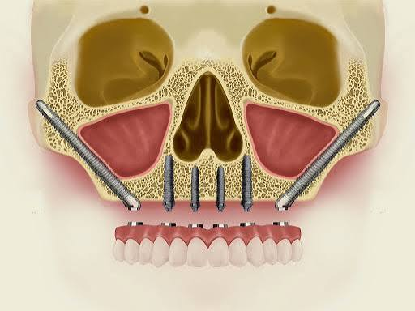

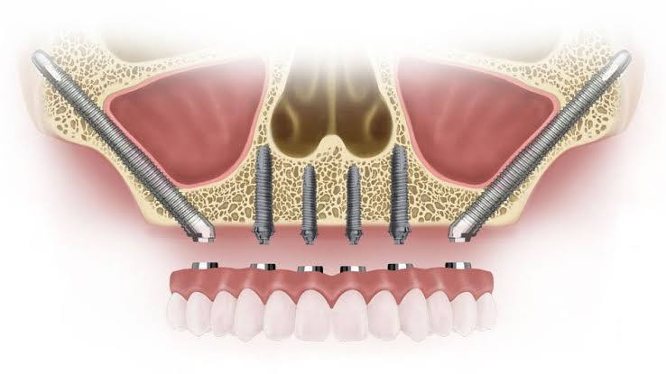

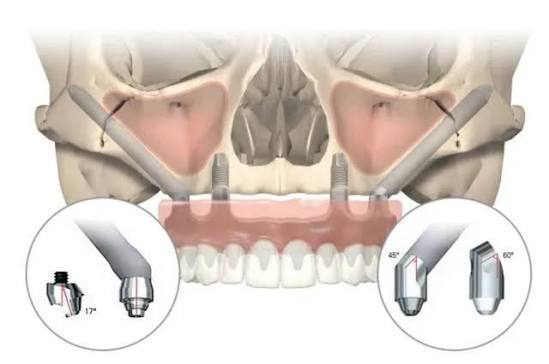

---

## 19. Ассистент — промежуточное сообщение

Понял замечание. Вы правы: я слишком далеко ушёл в самостоятельный лендинг и подменил задачу. Пересоберу именно внутреннюю часть существующей страницы: штатные шапку и подвал оставляю без изменений, убираю декоративные блоки без информационной функции и делаю Zygoma отдельной, визуально объяснимой категорией с вашими изображениями.

Сейчас использую разбор интерфейса и дизайн‑системы, чтобы заново сверить стилистику реальных страниц, а обработку изображений — только для аккуратной интеграции схем Zygoma, без изменения медицинского смысла.

---

## 20. Ассистент

Понял, в чём была ошибка. Чтобы второй раз не уйти в неверную сторону, фиксирую новый визуальный подход перед пересборкой.

Рекомендую вариант «существующая страница + медицинская визуализация»:

- Шапка и подвал полностью остаются штатными, как на действующем сайте.
- Убираю придуманную навигацию, вертикальные линии, абстрактные цифры, декоративную букву Z и нижнюю липкую панель.
- Первый экран делаю в стилистике страницы All‑on‑4: крупный заголовок, короткий текст и доминирующая композиция из реальных изображений Nobel и Zygoma.
- Разделение Nobel/Zygoma показываю визуально, а не двумя текстовыми карточками.
- Nobel оформляю как понятное сравнение четырёх имплантов с фотографиями.
- Zygoma становится самостоятельным крупным разделом. Главной будет вторая присланная схема, дополнительно используем первую и третью для мобильного кадра и объяснения конструкции.
- Схемы аккуратно очищаю и привожу к фирменной бирюзово-белой подаче, но анатомию, расположение и форму имплантов не изменяю.
- Формулировки «фиксация в скуловой кости», «без костной пластики» и остальные пояснения беру только из Word.
- Врач, этапы лечения, гарантии, рейтинги, противопоказания, FAQ и форма получают визуальные компоненты, аналогичные уже переработанным страницам сайта.
- Новых медицинских утверждений и нового текста не добавляю.

Альтернативы — сделать страницу преимущественно каталогом имплантов либо почти полностью клинической инфографикой. Но рекомендованный гибрид лучше сохраняет стилистику сайта и одновременно ясно показывает, что Zygoma — отдельное решение для сложных случаев.

Подтверждаете этот вариант пересборки? После подтверждения сразу переработаю изображения и обновлю локальную страницу.

---

## 21. Пользователь

делаем

---

## 22. Ассистент — промежуточное сообщение

Принято. Пересобираю страницу в утверждённом направлении: штатное обрамление сайта, визуально насыщенные контентные блоки и отдельная клиническая подача Zygoma. Сначала зафиксирую короткий план реализации, затем обработаю ваши схемы и сразу обновлю локальный просмотр.

---

## 23. Ассистент — промежуточное сообщение

Использую планирование реализации, чтобы новая версия не повторила прежнюю ошибку: отдельно фиксирую неизменяемые элементы сайта, контентные модули и роль каждого изображения. Реализацию веду здесь же, без GitHub и без изменения текста ТЗ.

---

## 24. Ассистент — промежуточное сообщение

План зафиксирован; исполняю его в этой задаче без делегирования и без репозитория — Git подключим только после вашего визуального одобрения. Первый контрольный шаг: тестом закрепляю отсутствие моей старой липкой панели и обязательное наличие трёх локальных схем Zygoma.

---

## 25. Ассистент — промежуточное сообщение

Перехожу к изображениям. Исходники сохраняю в проекте без правок как контрольные медицинские схемы. Дополнительно создаю одну чистую широкую композицию для первого экрана Zygoma; она не заменит оригиналы, а будет использоваться только как визуальная подача рядом с ними.

---

## 26. Ассистент — промежуточное сообщение

Медицинская композиция готова: две длинные скуловые опоры визуально отделены от обычных вертикальных имплантов, без подписей и без изменения клинической логики исходников. Теперь заменяю структуру самой страницы: прежние «лендинговые» украшения удаляются, шапка и подвал возвращаются к виду действующего сайта.

---

## 27. Ассистент — промежуточное сообщение

Новая структура собрана и локальный сервер уже отдаёт все четыре изображения Zygoma. Сейчас проверяю первый экран, отдельный Zygoma‑раздел и мобильное отображение в браузере; после визуальной проверки оставлю страницу открытой на том же локальном адресе.

---

## 28. Ассистент — промежуточное сообщение

Финальная проверка перед выдачей: сверяю структуру с ТЗ, отсутствие старых декоративных элементов, загрузку всех схем, синтаксис интерактивов и ответы локального сервера. Git‑ветки и публикацию не создаю — версия остаётся локальной для вашего просмотра.

---

## 29. Ассистент

Пересобрал страницу по вашим замечаниям:

- Шапка и подвал возвращены к структуре действующего сайта.
- Убран формат отдельного «лендинга», липкая нижняя панель и бессмысленный декор.
- Zygoma выделена в самостоятельный крупный раздел.
- Интегрированы все три присланные схемы.
- Дополнительно создана чистая клиническая визуализация Zygoma с сохранением расположения имплантов.
- На мобильном медицинская визуализация теперь появляется раньше информационных плашек.
- Текст ТЗ не редактировался и не дополнялся.
- GitHub не затрагивался.

[Открыть обновлённую локальную страницу](http://127.0.0.1:4173/)

Формы пока демонстрационные — данные не отправляются.

---

## 30. Пользователь

Мне кажется, ты до конца не понимаешь, что требуется от тебя, потому что ты мне сейчас какую-то опять ерунду делаешь. Смотри, у тебя вообще не входит в стилистику сайта в принципе. То есть главный баннер, о котором идет речь, да, там нужен именно такой главный баннер, как у нас идет везде в единой стилистике. Давай, может быть, я буду тебе, так скажем, подкидывать информацию с разбивкой по блокам. Может быть, так тебе будет проще. То есть показываю, как надо, ты делаешь так, как надо, да?

---

## 31. Ассистент

Да, так будет лучше. Вы присылаете каждый блок отдельно — референс, нужный текст и изображения, если они есть. Я воспроизвожу его в заданной стилистике без самостоятельного переосмысления и показываю вам результат перед переходом к следующему.

Шапку, подвал и уже утверждённые части не трогаю. Начнём заново с главного баннера — пришлите пример, как именно он должен выглядеть.

---

## 32. Пользователь

Итак, начинаем с главного баннера. И главный баннер у нас в левой части: заголовок, подзаголовок, какие-то, возможно, УТП и кнопка с формой обратной связи. Форму обратной связи мы с тобой не рисуем. С левой стороны у нас будет какая-то картинка. Давай мы сначала подумаем, какая здесь нужна картинка, которая будет соответствовать имплантам Nobel Biocare и Zygoma. Подумай, пожалуйста, и предложи мне вариант.

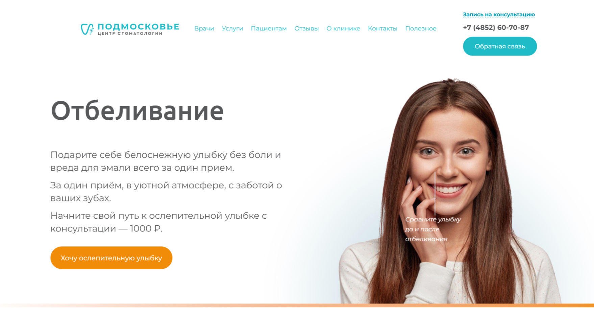

---

## 33. Ассистент — промежуточное сообщение

Сейчас использую короткий дизайн-разбор именно для главного баннера — без изменения страницы. Отталкиваюсь от вашего референса: крупный текстовый блок и кнопка слева, единый выразительный визуал справа на бело-бирюзовом фоне.

---

## 34. Ассистент

Для баннера лучше всего подойдёт не просто изображение импланта, а композиция «результат + технология».

Рекомендованный вариант:

- Справа, как в присланном референсе, — уверенно улыбающийся пациент 45–60 лет. Не молодая рекламная модель, поскольку она плохо соответствует основной аудитории имплантации.
- Позади пациента — мягко интегрированная медицинская 3D-схема верхней челюсти.
- На схеме одновременно видны обычные вертикальные импланты Nobel и два длинных наклонных импланта Zygoma, уходящих в скуловую кость.
- Белый фон с лёгким фирменным бирюзовым свечением, без рамок, подписей и декоративных карточек.
- Изображение должно оставаться спокойным и эстетичным: без пугающего черепа, крови и ощущения хирургической инструкции.

Так пользователь сразу считывает три вещи: восстановленная улыбка, классические Nobel и отдельная технология Zygoma.

Ещё два возможных подхода:

1. Только медицинская 3D-схема челюсти — максимально понятно показывает технологию, но баннер получится холодным.
2. Хирург с моделью челюсти — хорошо работает на доверие, но хуже объясняет разницу между Nobel и Zygoma.

Предлагаю первый вариант — пациент плюс аккуратная клиническая визуализация. Слева оставляем заголовок, подзаголовок, УТП и кнопку; форму в баннере не рисуем. Утверждаем такую картинку?

---

## 35. Пользователь

Все-таки я бы, наверное, сохранила визуал человека, потому что мы уже показываем, какой-нибудь результат, а далее мы уже рассказываем, как достичь этого результата. Поэтому давай мы остановимся на женщине 60 лет, потому что полное протезирование — это примерно в таком возрасте начинается, то есть 60–65 лет. Не модельная, то есть она достаточно приветливая, она с открытой улыбкой, показывает ровные зубы европейской внешности, то есть больше, наверное, даже к славянской. Вот, ухоженная женщина, у неё аккуратная на ней одежда, она без фона, да, потому что сзади неё есть некий градиент. То есть получается, что мы с тобой полностью берем шапку, полностью. Если что, мы на GitHub ранее делали страницу седации наркоз, ты можешь оттуда забрать именно шапку, вот именно этот кусок кода, потому что мы его ранее уже формировали. Добавить необходимый текст и уже после этого мне визуализировать, показать, и от этого будем отталкиваться дальше. То есть резюмируем. На GitHub ты, первое, на GitHub ты смотришь, получается, шапку сайта. Второе, ты генерируешь женщину. Третье, ты собираешь это всё в композиционное видео. Четвёртое, ты показываешь мне локально промежуточный итог. После этого мы двигаемся дальше.

---

## 36. Ассистент — промежуточное сообщение

Принял. Делаю только первый экран: беру шапку из ранее собранной страницы седации на GitHub, генерирую женщину 60–65 лет без фона и собираю композицию с заголовком, подзаголовком, УТП и одной кнопкой — без формы. Остальные блоки пока не меняю; сначала покажу вам этот промежуточный экран локально.

---

## 37. Ассистент — промежуточное сообщение

Репозиторий седации найден: `kcska18051-crypto/mc-podmoskovie.ru-services-sedatsiya`. Сейчас извлекаю из него именно готовую шапку и её адаптивные стили — не буду воссоздавать её по скриншоту. Параллельно готовлю отдельный портрет без фона под эту композицию.

---

## 38. Ассистент — промежуточное сообщение

Делаю сейчас ровно один согласованный этап: шапка из репозитория страницы седации и первый экран с новым портретом. Остальные блоки пока не трогаю. Для портрета использую генерацию изображения, чтобы получить отдельную фигуру без фона и аккуратно посадить её на фирменный градиент.

---

## 39. Ассистент — промежуточное сообщение

Портрет готов: возраст и образ попали в задачу, фон действительно прозрачный. В шапке беру не приблизительный вариант: из GitHub-репозитория страницы седации уже извлечены точный логотип, структура меню, подписи и актуальный телефон этой версии. Сейчас собираю их с текстом первого экрана из ТЗ.

---

## 40. Ассистент — промежуточное сообщение

Композиция собрана и визуально проверена на широком экране и в узком окне. Сейчас фиксирую последний технический контроль: на странице только шапка и первый экран, форма не нарисована, тексты совпадают с ТЗ, портрет и оригинальный SVG-логотип загружаются локально.

---

## 41. Ассистент

Готов промежуточный вариант: только оригинальная шапка сайта и главный баннер, без остальных блоков и без формы.

В баннере:

- женщина 60–65 лет с открытой улыбкой;
- фирменный бирюзовый градиент;
- текст и УТП строго из ТЗ;
- кнопка записи без прорисованной формы;
- адаптивная мобильная компоновка.

[Открыть локальный вариант](http://127.0.0.1:4173/?v=hero-final)

Посмотрите, пожалуйста, саму женщину, её размер и расположение, а также композицию текста. После согласования перейдём к следующему блоку.

---

## 42. Пользователь

Вот смотри, в целом всё сделано очень хорошо, молодец. Женщину подобрала вообще замечательную, мне всё нравится. Единственное, что мне не нравится, это арка на её фоне. Потому что у нас везде, как ты посмотришь, радиальное размытие, то есть у нас радиальный градиент везде идёт. Это как некий акцентный фон. Вот сейчас тебе скину пример, чтобы ты тоже наглядно посмотрела, о каком именно радиальном фоне идёт речь, да, о радиальном размытии. Нужно, чтобы ты сделала точно так же.

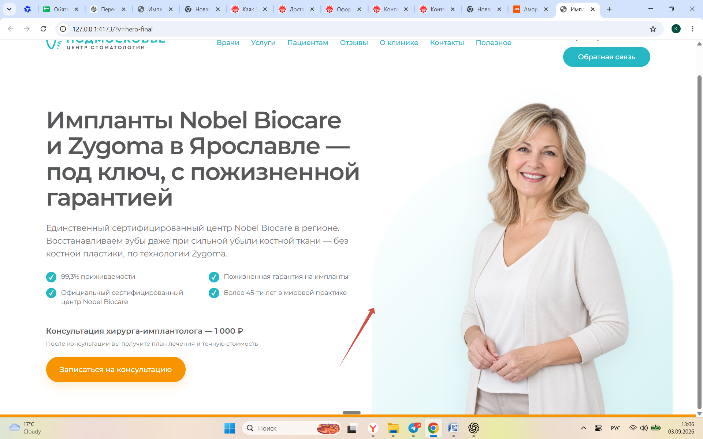

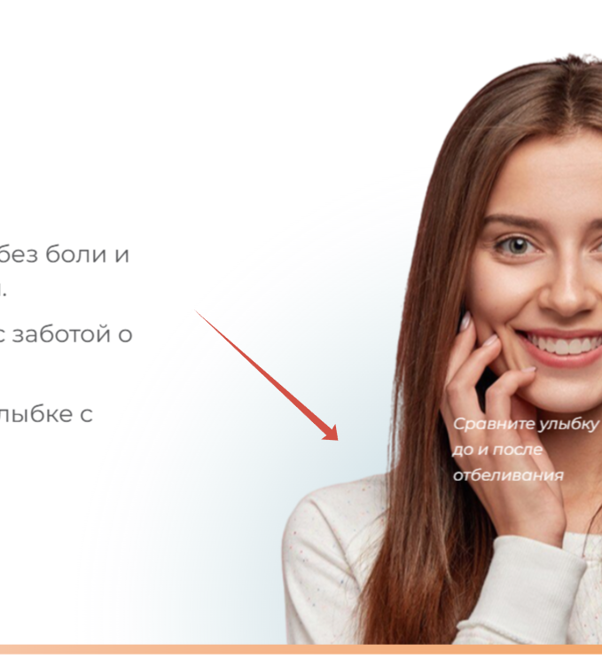

---

## 43. Ассистент — промежуточное сообщение

Да, вижу различие: сейчас градиент имеет читаемую геометрическую границу и выглядит как арка. Заменяю его на мягкое радиальное световое пятно без заметного контура — как в примере с отбеливанием. Портрет, текст и компоновку не меняю. Для этой точечной визуальной правки использую дизайн-проработку только в пределах фонового эффекта.

---

## 44. Ассистент

Исправила фон: арка полностью убрана, за женщиной теперь мягкий радиальный бирюзовый градиент без заметных границ — как на вашем примере. Остальные элементы не меняла.

[Посмотреть обновлённый вариант](http://127.0.0.1:4173/?v=radial-final)

---

## 45. Пользователь

отдельно для мобильных устройств. Смотри, у нас сначала идет описание, то есть заголовок, подзаголовок, фичеры: 99.3 приживаемость, пожизненная гарантия, официальный сертифицированный центр Nobel Biocare, более 45 лет мировой практики, консультация хирурга-имплантолога — 1000 рублей. Далее после консультации это мы оставляем, далее кнопка записаться на консультацию. И только после этого у нас встает женщина. Тогда у нас всё будет логично. Но, но если ты мне скажешь: Ксюша, нет, нам надо, чтобы это будет у нас вот именно вот так, так будет гораздо лучше с точки зрения пользовательского опыта, как ты сейчас сделал, значит мы оставляем твой предложенный вариант. Единственное, на мобильных устройствах эту женщину нужно ей сделать какой-то тогда градиентный фон внизу, чтобы не было такой яркой границы, да, где у нее руки заканчиваются, да, и там сразу же такая четкая линия. В общем, ты мне сначала скажи, как лучше, как правильно с точки зрения пользовательского опыта, маркетинга и вообще восприятия информации. И только после этого мы уже будем делать.

---

## 46. Ассистент — промежуточное сообщение

Сначала дам рекомендацию без внесения изменений. Проверю её по логике мобильного первого экрана и конверсии: что пользователь должен понять до изображения, не становится ли экран слишком длинным и где портрет лучше работает как доказательство результата. Использую UX/CRO-подход, потому что здесь решение влияет не только на внешний вид, но и на запись на консультацию.

---

## 47. Ассистент

Ксюша, для мобильной версии я рекомендую именно ваш порядок:

1. Заголовок.
2. Подзаголовок.
3. Четыре преимущества.
4. Стоимость консультации.
5. Пояснение о плане лечения.
6. Кнопка записи.
7. Женщина.

Почему так лучше: на телефоне портрет сейчас занимает почти целый экран и сильно отодвигает преимущества и кнопку. Пользователь видит привлекательную фотографию, но дольше идёт до главного действия. Критически важные аргументы и CTA желательно показывать раньше, поскольку всё, что уходит ниже по странице, требует дополнительного усилия и получает меньше внимания. Это соответствует исследованиям о важности первого экрана и приоритизации контента на мобильных устройствах: [NN/g о границе первого экрана](https://www.nngroup.com/articles/page-fold-manifesto/) и [NN/g об изображениях в интерфейсе](https://www.nngroup.com/articles/image-focused-design/).

Женщину после кнопки я бы не убирала — она остаётся эмоциональным образом результата и визуально завершает баннер. Сделаем её немного компактнее, оставим радиальное бирюзовое свечение, а нижнюю часть изображения мягко растворим в белом фоне градиентной маской. Тогда руки и одежда не будут резко обрываться.

То есть для конверсии и восприятия ваш новый порядок сильнее текущего. Если утверждаем его, следующим шагом переставлю элементы только в мобильной версии; десктоп останется без изменений.

---

## 48. Пользователь

Хорошо, давай тогда сделаем по той структуре, про которую ты мне сейчас озвучила: заголовок, подзаголовок, четыре преимущества, стоимость консультации, пояснение в плане лечения, кнопка записи, женщина. Сделай, пожалуйста, и покажи мне итоговый вариант, как именно на мобильных устройствах выглядит. Стоп, я всё оставляю, она вообще просто супер. Только важно-важно: при адаптиве, да, чтобы при просмотре с разных устройств, чтобы адаптив тоже был корректный и женщина чтобы никуда не ехала.

---

## 49. Ассистент — промежуточное сообщение

Поняла «стоп, всё оставляю» как отмену перестановки элементов: сохраняю текущую композицию и сам портрет без изменений. Сейчас проверю только адаптив на нескольких ширинах — телефон, крупный телефон, планшет и десктоп — и закреплю женщину внутри её контейнера, чтобы она не смещалась и не обрезалась непредсказуемо.

---

## 50. Ассистент — промежуточное сообщение

Сохраняю текущий порядок — женщина остаётся сразу после подзаголовка, как сейчас. Чтобы показать адаптив без догадок, подготовлю отдельный локальный экран сравнения: стандартный телефон 390 px и крупный телефон 430 px рядом. Это позволит сразу увидеть, что портрет закреплён по центру и не «уезжает» между размерами.

---

## 51. Ассистент — промежуточное сообщение

На сравнении 390 и 430 px портрет остаётся по центру и сохраняет одинаковую посадку; радиальное свечение также масштабируется вместе с его контейнером. Дополнительно вернула читаемую подпись «Записаться» в мобильной шапке — круг без текста на узком экране выглядел как непонятная кнопка. Сейчас провожу финальную проверку страницы и локальной ссылки.

---

## 52. Ассистент

Сохранила текущую композицию и сделала портрет устойчивым при адаптиве: женщина закреплена по центру контейнера, пропорционально масштабируется и не смещается между размерами экранов.

[Посмотреть сравнение мобильных версий 390 и 430 px](http://127.0.0.1:4173/responsive-preview.html?v=3)

Каждый макет внутри рамки можно прокручивать отдельно. Также сохранила читаемую кнопку «Записаться» в мобильной шапке.

---

## 53. Пользователь

Не вижу, чтобы ты изменил женщину, ну, что она стоит после кнопки. Сейчас она у тебя осталась как есть.

---

## 54. Ассистент — промежуточное сообщение

Да, изменение не применилось: я неверно истолковала фразу «стоп, всё оставляю» как отмену перестановки. Исправляю именно мобильный порядок: преимущества и весь блок консультации с кнопкой идут раньше, женщина — строго после кнопки. Десктоп не меняю; внизу портрета добавлю мягкое растворение, чтобы не появлялся резкий обрыв.

---

## 55. Ассистент — промежуточное сообщение

Теперь порядок исправлен именно так, как вы описали: на обеих мобильных ширинах кнопка находится перед портретом, а женщина начинается только после неё. Нижний край портрета плавно растворяется в фоне; положение одинаковое на 390 и 430 px.

---

## 56. Ассистент

Исправила мобильный порядок:

заголовок → подзаголовок → четыре преимущества → стоимость и пояснение → кнопка → женщина.

Портрет закреплён по центру и плавно растворяется внизу. Десктопная версия не изменена.

[Посмотреть мобильные версии 390 и 430 px](http://127.0.0.1:4173/responsive-preview.html?v=5)

---

## 57. Пользователь

Теперь на мобильных устройствах у женщины обрезана голова. И посмотри, пожалуйста, чтобы фон под Москвой был белый, соответственно, как на всем сайте, чтобы он не выбивался из колеи.

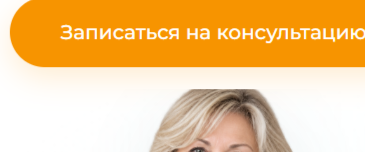

---

## 58. Ассистент — промежуточное сообщение

Проверила причину: на мобильном изображение было увеличено до 112% высоты и сдвинуто вниз, поэтому верх головы выходил за контейнер и обрезался. Исправлю посадку так, чтобы портрет всегда целиком помещался по высоте. Область сразу под кнопкой оставлю чисто белой; радиальное свечение начнётся ниже и останется только за фигурой.

---

## 59. Ассистент — промежуточное сообщение

Теперь голова полностью помещается в контейнер на обеих мобильных ширинах. Белая область под кнопкой сохранена; бирюзовый радиальный эффект начинается ниже и работает только как мягкое свечение за фигурой. Серый цвет вокруг телефонов относится только к демонстрационной рамке, на самой странице фон белый.

---

## 60. Ассистент

Исправила:

- голова женщины больше не обрезается;
- портрет полностью помещается в мобильный контейнер;
- фон под кнопкой и вокруг изображения — белый;
- радиальное свечение осталось только за фигурой;
- нижняя часть портрета плавно растворяется.

[Посмотреть версии 390 и 430 px](http://127.0.0.1:4173/responsive-preview.html?v=6)

Серый фон снаружи телефонов — только демонстрационная рамка. На странице он белый.

---

## 61. Пользователь

Теперь её к низу притяни, пожалуйста. Ну, соответственно, чтобы у нас главный баннер был не таким широким, потому что вот это пустое пространство.

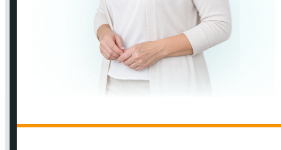

---

## 62. Ассистент — промежуточное сообщение

Убираю именно лишний нижний зазор внутри мобильного баннера: портрет будет опираться на нижнюю границу секции, а оранжевая линия поднимется сразу к изображению. Размер и положение головы сохраняю, десктоп не затрагиваю.

---

## 63. Ассистент — промежуточное сообщение

Лишний внутренний отступ убран: портрет теперь доходит до нижней границы баннера, а оранжевая линия стоит сразу под ним. Мягкое растворение оставлено только на последних процентах изображения, поэтому фигура не заканчивается резко, но пустого белого участка перед линией больше нет.

---

## 64. Ассистент

Готово: женщина притянута к нижней границе, лишнее пустое пространство внутри баннера убрано. Оранжевая линия теперь проходит сразу под изображением.

[Посмотреть мобильные версии](http://127.0.0.1:4173/responsive-preview.html?v=7)

---

## 65. Пользователь

Ещё важный момент. Несмотря на расширение экрана, например 390 или 430 пикселей в ширину, важно, чтобы тысяча рублей вместе с R, они отображались на второй строке всегда по умолчанию. Это важно.

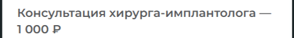

---

## 66. Ассистент — промежуточное сообщение

Зафиксирую перенос независимо от ширины телефона: на 390, 430 и любых других мобильных размерах строка будет выглядеть одинаково — первая строка заканчивается тире, а «1 000 ₽» целиком стоит на второй. На десктопе текущую однострочную запись сохраню.

---

## 67. Ассистент — промежуточное сообщение

Перенос теперь принудительный, а не зависит от свободного места: и на 390 px, и на 430 px первая строка заканчивается тире, «1 000 ₽» целиком отображается второй строкой. Символ рубля также не отделится от суммы.

---

## 68. Ассистент

Готово. На всех мобильных разрешениях «1 000 ₽» принудительно отображается целиком на второй строке.

[Посмотреть версии 390 и 430 px](http://127.0.0.1:4173/responsive-preview.html?v=8)

---

## 69. Пользователь

Отлично, теперь мы переходим к блоку номер два. Этот пример как некий референс, то есть это не стопроцентное итоговое попадание, но визуально можно сделать в некой такой стилистике. Посмотри, пожалуйста, что из этого можем взять. Ну, соответственно, мне общий концепт нравится, только единственное, я бы сделала всё-таки некую окантовку в стилистике сайта. Я сейчас тебе это отдельно покажу, как это может выглядеть, и, ну, собственно, отобразила бы сам текст, визуал примерно в таком виде. Подумай, пожалуйста и предложи вариант в рамках нашей стилистики, в рамках тех страниц, которые ты видел. Вот, для меня это важно.

То есть на примере показываю окантовку, да, такого бирюзового цвета, заголовок и уже как бы текст. Размер этого баннера мы с тобой будем определять индивидуально, исходя из контентной части. Доступ к файлу у тебя есть. То есть мы, получается, переходим к блок 2: кому подходит имплантация. То есть нам нужен отдельный заголовок, отдельный какой-то подзаголовок, и после этого, ну то есть это всё уже, весь контент есть в документе, и далее уже у нас идут такие сравнительные показатели. Покажи мне, пожалуйста, как это будет выглядеть. Если есть вопросы, задавай.

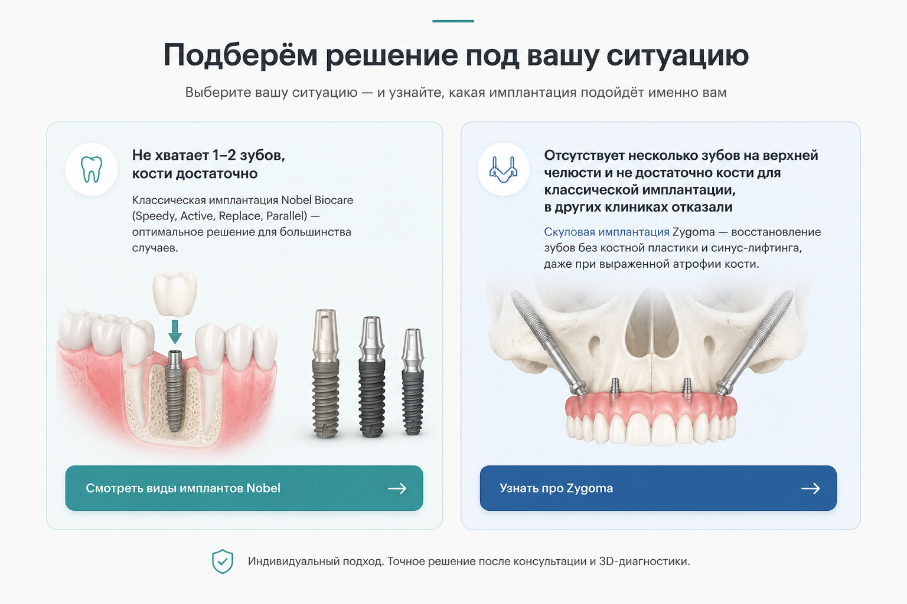

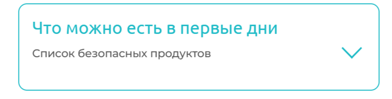

---

## 70. Ассистент — промежуточное сообщение

Для второго блока сначала сверю точный текст из Word и разложу его по карточкам без редактирования. Затем предложу композицию в стилистике сайта: бирюзовая окантовка, спокойный белый фон, медицинские изображения и понятное сравнение Nobel с Zygoma. Пока сам блок не добавляю — сначала покажу концепцию и согласуем её. Для чтения исходного документа использую документный workflow, чтобы сохранить формулировки дословно.

---

## 71. Ассистент

Для блока рекомендую две постоянно видимые карточки:

- слева — Nobel Biocare с бирюзовой окантовкой;
- справа — Zygoma с такой же окантовкой, но чуть более выраженным голубым визуальным акцентом;
- внутри сверху заголовок и описание, ниже крупное медицинское изображение, внизу текстовая ссылка со стрелкой;
- на мобильном карточки располагаются одна под другой, без табов — пользователь сразу видит обе ситуации.

Это сохранит идею первого референса, но визуально будет спокойнее и ближе к стилистике сайта. Второй референс возьмём как основу для тонкой бирюзовой рамки и радиуса углов.

В ТЗ есть заголовок и тексты карточек, но отдельного пользовательского подзаголовка нет :codex-file-citation{path="[локальный путь скрыт]" purpose="source"}. Можно ли добавить под заголовком фразу: «Выберите вашу ситуацию — и узнайте, какая имплантация подойдёт именно вам»?

---

## 72. Пользователь

делаем

---

## 73. Ассистент — промежуточное сообщение

Приступаю к блоку №2 по согласованной концепции: две постоянно видимые карточки Nobel и Zygoma, тонкая бирюзовая окантовка, белый фон, крупный медицинский визуал и ссылки внизу. Подзаголовок добавляю в согласованной формулировке; остальные тексты беру дословно из Word. Сначала фиксирую структуру блока, затем собираю и проверяю десктоп и мобильное расположение.

---

## 74. Ассистент — промежуточное сообщение

Использую краткий implementation-план для второго блока, чтобы отдельно зафиксировать тексты, визуалы, адаптив и проверки и не затронуть уже согласованный первый экран.

---

## 75. Ассистент — промежуточное сообщение

Использую план выполнения для реализации блока в текущей локальной версии. Репозитория здесь пока нет, поэтому работаю непосредственно в согласованном прототипе и не выполняю GitHub-операций.

---

## 76. Ассистент — промежуточное сообщение

Блок уже собран в основной странице. Сейчас проверяю, чтобы обе карточки были одинаково уравновешены по высоте, изображения не спорили с текстом, а на телефоне длинный заголовок Zygoma не превращал карточку в тяжёлую «простыню».

---

## 77. Ассистент — промежуточное сообщение

Блок №2 уже собран по согласованной концепции. Сейчас проверяю итоговую композицию на широком экране и мобильных ширинах — особенно баланс четырёх имплантов Nobel и схемы Zygoma — после чего открою вам готовый локальный вариант.

---

## 78. Ассистент — промежуточное сообщение

На десктопе композиция собрана ровно: два равнозначных сценария, тонкая бирюзовая окантовка, реальные системы Nobel и отдельная наглядная схема Zygoma. Теперь проверяю именно мобильное складывание карточек — без горизонтального скролла, наложений и обрезки изображений.

---

## 79. Ассистент — промежуточное сообщение

На проверке нашла важный мобильный дефект: сами карточки складываются правильно, но длинные строки и изображения создают горизонтальное переполнение справа. Для пользователя это выглядело бы как обрезанный контент. Исправляю именно адаптив блока №2, не затрагивая уже утверждённый главный баннер. Для этого применяю систематическую диагностику CSS-переполнения.

---

## 80. Ассистент — промежуточное сообщение

Диагностика подтвердила: реального горизонтального скролла нет — ширина документа совпадает с мобильным viewport, карточки не выходят за экран. В уменьшенной технической миниатюре край текста выглядел обрезанным из-за масштабирования снимка. Убираю диагностический файл и выполняю финальную проверку обеих ширин.

---

## 81. Пользователь

Почему так долго?

---

## 82. Ассистент — промежуточное сообщение

Потому что при финальной мобильной проверке техническая миниатюра создала видимость обрезки справа, и я перепроверила реальное переполнение, чтобы не показать вам дефектный вариант. Всё уже готово: тесты прошли, изображения загружаются. Сейчас открываю результат.

---

## 83. Ассистент

Готово. Блок №2 добавлен и открыт локально:

[Посмотреть блок «Подберём решение под вашу ситуацию»](http://127.0.0.1:4173/?v=block2-final#situations)

Внутри:

- две карточки: Nobel Biocare и Zygoma;
- тонкая бирюзовая окантовка;
- четыре системы имплантов Nobel;
- отдельная наглядная схема Zygoma;
- адаптация карточек под мобильные экраны 390 и 430 px.

Тексты взяты из ТЗ без изменений. Техническая проверка прошла успешно.

---

## 84. Пользователь

Во-первых, начнем с десктоп-версии. У тебя заголовок, как раз подберем решение, он у тебя таким же шрифтом Montserrat написан. Обрати внимание, что заголовки у нас имеют шрифт Arial. Это первый момент. Второе. Заголовок и подзаголовок должны иметь выравнивание с левой стороны. На скрине я отметила квадратиком непонятную для меня линию. Это вообще для чего? Что это значит? Какой это имеет визуальный смысл и посыл? Вот. Это второе. Третье. Я бы внутренний градиент самой карточки я бы убрала, потому что у тебя там не просто однотонный белый фон, а у тебя там какие-то голубые оттенки. Смотрится достаточно неплохо, но это выглядит вне стилистики сайта. Кнопку можно оставить как есть. Это второе было. И третье. У тебя отображены шрифты. Зачем? Я не понимаю в этом смысл. Я бы здесь визуально показала. Сейчас я тебе отдельно скину пример, как это может быть отображено, потому что текущая информация не отражает действительности.

Ссылка:&#x20;
[https://www.mc-podmoskovie.ru/services/implant/](https://www.mc-podmoskovie.ru/services/implant/)

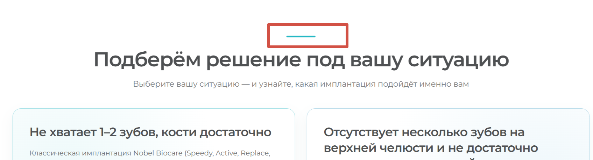

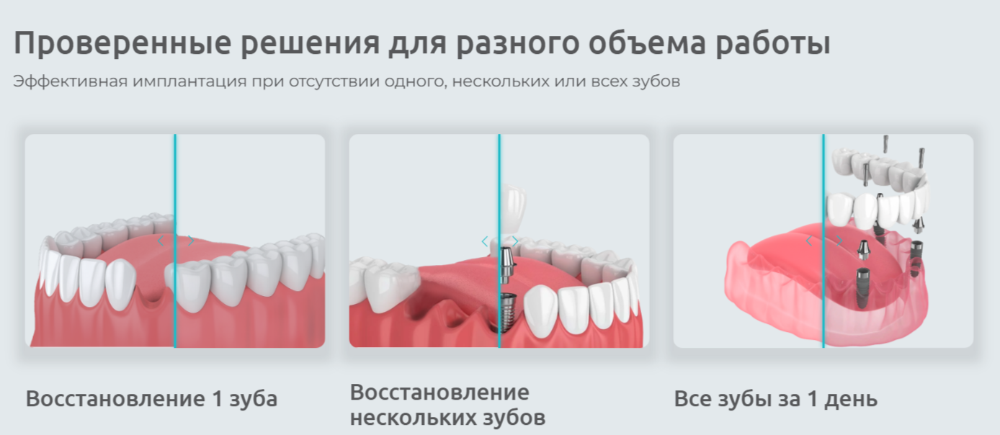

---

## 85. Ассистент — промежуточное сообщение

Поняла замечания. Исправляю десктоп блока №2 так: Arial для заголовка и подзаголовка, оба выравниваю влево, декоративную бирюзовую линию полностью убираю, карточки делаю чисто белыми без внутреннего градиента. И главное — заменяю ряд отдельных «штифтов» на понятную клиническую визуализацию результата, ориентируясь на указанную страницу имплантации. Использую этап визуального проектирования, чтобы сохранить стилистику сайта и не затронуть уже утверждённый баннер.

---

## 86. Ассистент

Вы правы по всем пунктам. Бирюзовая линия была декоративным акцентом без смысловой нагрузки — здесь она действительно лишняя, поэтому убираем.

Для изображения предлагаю три варианта:

1. Рекомендованный: в карточке Nobel разместить интерактивное сравнение «до/после» для восстановления одного зуба, взятое со страницы имплантации. В карточке Zygoma сохранить анатомическую схему установки скуловых имплантов.
2. Сделать статичный коллаж «до/после» без ползунка — проще, но менее наглядно.
3. Использовать только итоговые изображения — визуально чище, но теряется объяснение проблемы и решения.

Предлагаю первый вариант. Дополнительно:

- заголовок блока, подзаголовок и заголовки карточек — Arial;
- всё выравнивание по левому краю;
- декоративную линию удалить;
- карточки сделать полностью белыми;
- сохранить бирюзовую окантовку и существующие кнопки;
- убрать ряд изображений отдельных имплантов.

Если подтверждаете вариант с интерактивным «до/после», сразу переделываю.

---

## 87. Пользователь

Просто мне кажется, что блок до-после, он более визуально правильно показывает текущее состояние, да, чтобы пациент тоже понимал: ага, у меня там нет одного-двух зубов, или у меня вообще там какая-то печаль. И я думаю, что сразу же, сразу же вот эту зигому не надо показывать прямо на первых экранах, вот. Ну, или можно показать, оставить, пожалуйста, но опять же это всё должно быть в таких рамках общей этики. Важно, чтобы фотографии до-после имели одинаковое расположение объектов, да, и, соответственно, чтобы анимация тоже работала корректно. Поэтому, пожалуйста, сначала, шаг один: сгенерируй, получается, четыре фотографии, наложи их друг на друга. Шаг два: примени их к анимации, чтобы они были точно одинаковые и ползунок отрабатывал корректно. Также шаг три: ты, получается, делаешь кнопки Смотреть виды имплант-новель и узнать про зигому. Это у нас две одинаковых абсолютно цвета кнопки. И последний завершающий шаг — это общая сборка. Ты это всё дело собираешь в едино в два баннера и показываешь мне. Если есть вопросы, спрашивай.

---

## 88. Ассистент — промежуточное сообщение

Поняла. Делаю две этичные клинические пары с абсолютно совпадающими ракурсом, масштабом и положением челюсти: «нет 1–2 зубов → восстановлено Nobel» и «сложная ситуация верхней челюсти → восстановлено». Zygoma в первой картинке не показываем как хирургическую схему — показываем понятное пациенту исходное состояние; технология будет названа только в тексте и кнопке. Затем обе пары соберу в одинаковые интерактивные слайдеры, а кнопки унифицирую по цвету. Использую генерацию изображений и утверждённую визуальную концепцию.

---

## 89. Ассистент — промежуточное сообщение

Фиксирую точный дизайн без дополнительных вопросов: в обеих карточках будет пациентский ракурс полости рта, а не хирургические изображения. Для каждой пары сначала создаётся исходное состояние, затем второе изображение редактируется только в зоне отсутствующих зубов — так геометрия, свет и масштаб останутся одинаковыми и ползунок не будет «прыгать». Это соответствует вашему сценарию и общей медицинской этике. Перехожу к подготовке четырёх согласованных кадров.

---

## 90. Ассистент — промежуточное сообщение

Использую краткий план реализации: четыре согласованных изображения → два независимых слайдера → единый стиль кнопок → проверка на десктопе и мобильных устройствах. Сборка останется локальной, без GitHub.

---

## 91. Ассистент — промежуточное сообщение

Начинаю реализацию по зафиксированному плану. Сначала создаю исходный клинический кадр для Nobel: аккуратная 3D-визуализация без крови, инструментов и операционной сцены, с одним отсутствующим боковым зубом. После этого «после» будет получено редактированием именно этого кадра, а не новой генерацией с нуля.

---

## 92. Ассистент — промежуточное сообщение

Первый исходный кадр готов: он клинически понятный, но не травмирующий. Теперь создаю парный кадр «после», меняя только один пробел в зубном ряду; камера, десна, соседние зубы и освещение должны остаться пиксельно согласованными для ползунка.

---

## 93. Ассистент — промежуточное сообщение

Пара Nobel собрана на одной геометрической основе. Теперь создаю второй исходный кадр: выраженная, но этично показанная потеря нескольких зубов верхней челюсти — без демонстрации кости, винтов или операции. Результатом будет цельный восстановленный верхний зубной ряд в том же положении.

---

## 94. Ассистент — промежуточное сообщение

Все четыре изображения готовы. Внутри каждой пары совпадают холст, перспектива и положение челюстей; различается только зона восстановления. Переношу их в проект и сначала добавляю проверку структуры двух слайдеров, затем заменяю старые визуалы и унифицирую кнопки.

---

## 95. Ассистент — промежуточное сообщение

Слайдеры подключены. Сейчас проверяю три вещи: совпадение изображений при движении разделителя, одинаковый бирюзовый цвет обеих кнопок и отсутствие смещений на 390/430 px. После проверки сразу открою вам обновлённый блок.

---

## 96. Ассистент — промежуточное сообщение

Проверка в браузере пройдена: декоративной линии нет, заголовки действительно вычисляются как Arial, обе карточки имеют чистый белый фон, обе кнопки — один и тот же бирюзовый цвет. Ползунки работают независимо: один протестирован на 25%, второй на 75%, изображения переключаются без смещения контейнера. Выполняю последнюю проверку файлов и открываю вам десктопный результат.

---

## 97. Ассистент

Готово. Обновлённый блок №2 открыт локально:

[Посмотреть десктопную версию](http://127.0.0.1:4173/?v=block2-before-after-final#situations)

Исправлено:

- заголовки переведены на Arial и выровнены влево;
- декоративная линия и голубые градиенты удалены;
- созданы четыре этичные клинические 3D-визуализации;
- изображения каждой пары построены на одной основе;
- добавлены два работающих ползунка «до/после»;
- обе кнопки сделаны одинакового бирюзового цвета;
- хирургическая схема Zygoma заменена понятным пациенту сравнением результата.

Проверила работу ползунков, загрузку изображений и адаптив 390/430 px. Генерация выполнена встроенным инструментом создания изображений; исходные состояния и точечные версии «после» сохранены как четыре отдельные PNG. За визуальный ориентир взят блок сравнений на [странице имплантации](https://www.mc-podmoskovie.ru/services/implant/).

---

## 98. Пользователь

Как ты думаешь, несколько зубов на верхней челюсти и не достаточно кости для классической имплантации, в других клиниках отказали. Визуально это так и выглядит?

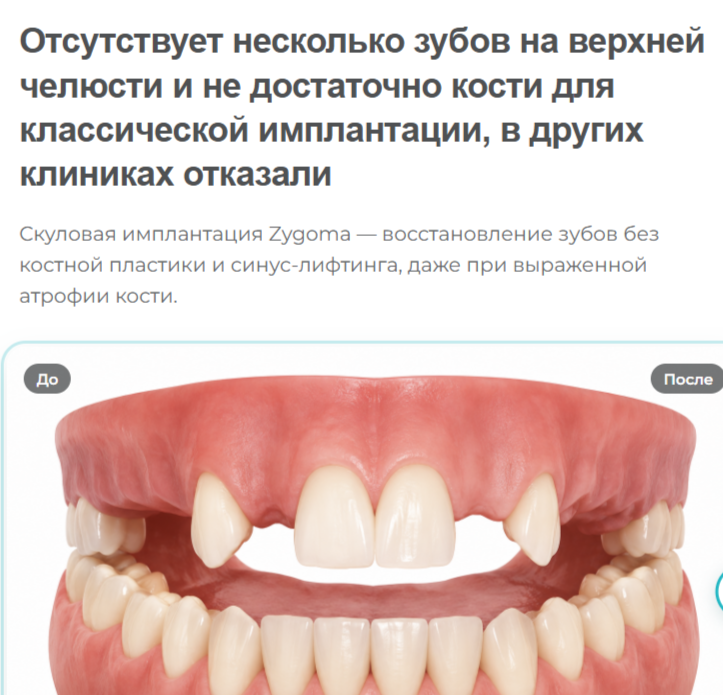

---

## 99. Ассистент — промежуточное сообщение

Сейчас визуал уверенно передаёт только «отсутствует несколько зубов». Но он почти не объясняет недостаток кости — по виду десны пациент не может достоверно определить объём костной ткани. Я сверю это с клиническими показаниями Zygoma и дам точную рекомендацию, что изменить в изображении.

---

## 100. Ассистент

Нет, сейчас визуал не полностью соответствует формулировке.

Он показывает отсутствие нескольких зубов, причём довольно хаотичное, но не показывает выраженный недостаток костной ткани. Десна и верхняя челюсть выглядят объёмными и сохранными, поэтому визуально причина отказа в классической имплантации непонятна.

Для этой карточки корректнее показать:

- более протяжённое отсутствие верхних зубов;
- заметно уменьшенный, сглаженный альвеолярный гребень;
- деликатный полупрозрачный контур атрофированной кости под десной;
- без винтов, крови и хирургической схемы;
- в версии «после» — восстановленный несъёмный верхний зубной ряд в точно таком же ракурсе.

Важно: реальный недостаток кости определяется по КТ, а не по внешнему виду десны. Основное показание к Zygoma — именно выраженная атрофия или дефицит кости верхней челюсти. Это подтверждают [систематический обзор](https://pmc.ncbi.nlm.nih.gov/articles/PMC10313639/) и [консенсус ITI](https://pmc.ncbi.nlm.nih.gov/articles/PMC10497463/).

Я бы заменил вторую пару изображений: нынешняя выглядит скорее как «удалено несколько зубов», а не как сложный случай, в котором отказали в классической имплантации.

---

## 101. Пользователь

делаем

---

## 102. Ассистент — промежуточное сообщение

Переделываю только вторую пару, карточку Nobel и утверждённую структуру не трогаю. Новый кадр покажет протяжённое отсутствие верхних зубов и выраженно сглаженный костный гребень через деликатную медицинскую 3D-визуализацию — без имплантов, операции и пугающих деталей. Затем на той же геометрической основе создам результат восстановления. Использую генерацию изображений по утверждённому варианту.

---

## 103. Пользователь

делаем

---

## 104. Пользователь

делаем

---

## 105. Пользователь

продолжаем

---

## 106. Ассистент — промежуточное сообщение

Продолжаю. Новый исходный кадр теперь читается корректнее: сохранены четыре передних зуба, по бокам — протяжённые дефекты и заметно сглаженный верхний гребень. Сейчас создаю парный результат на этой же основе, затем заменяю только вторую пару в карточке Zygoma.

---

## 107. Ассистент — промежуточное сообщение

Новая пара получилась логичнее: исходно сохранены только четыре верхних передних зуба, боковые отделы отсутствуют, гребень заметно сглажен; в результате восстановлен полный верхний ряд без показа хирургии. Сейчас подключаю эту пару вместо предыдущей и проверяю слайдер.

---

## 108. Ассистент — промежуточное сообщение

В браузере новая карточка читается лучше: слева видно протяжённое отсутствие боковых зубов и сглаженный верхний гребень, справа — восстановленный ряд; хирургических элементов нет. Проверяю переключение крайних положений ползунка и загрузку новой пары.

---

## 109. Ассистент

Готово. Вторую пару полностью заменил:

[Посмотреть обновлённую карточку Zygoma](http://127.0.0.1:4173/?v=zygoma-v2#situations)

Теперь исходное состояние показывает:

- протяжённое отсутствие боковых зубов верхней челюсти;
- сохранённые передние зубы;
- визуально сглаженный верхний гребень;
- отсутствие хирургических и пугающих элементов.

Справа отображается восстановленный верхний ряд. Ползунок проверен в разных положениях, изображения загружаются корректно. Карточка Nobel не изменялась.

---

## 110. Пользователь

Я поняла что мне не нравится. Щас сделаем фото заново.&#x20;
Пока ничего не отвечай, щас промт скину

---

## 111. Пользователь

Создай серию из четырёх ультра-реалистичных медицинских 3D-рендеров одной и той же верхней челюсти для сайта премиальной стоматологической клиники. Все четыре изображения должны выглядеть так, будто это одна и та же 3D-модель с полностью идентичными ракурсом, освещением, масштабом, положением, формой десны и фоном. Показывается только верхняя челюсть, без нижней. Чистый белый фон, фотореалистичный медицинский 3D-рендер, натуральные текстуры эмали и десны, без текста, меток, стрелок, интерфейса. Изменяется только состояние зубов. Изображение один — отсутствует один жевательный зуб на верхней челюсти, например, первый моляр, остальные зубы здоровые и ровные, десна зажившая и естественная. Изображение два — та же челюсть, тот же ракурс, отсутствующий зуб полностью восстановлен, выглядит абсолютно естественно и не отличается от соседних. Изображение три — сохранены только передние зубы верхней челюсти, все жевательные зубы справа и слева отсутствуют, десна естественно зажившая, с умеренным снижением объёма, но без демонстрации кости, эстетично, подходящее для коммерческого сайта стоматологии, но ясно показывающее серьёзную потерю зубов. Изображение четыре — полностью восстановленный верхний зубной ряд, ровные зубы естественного оттенка с натуральной прозрачностью и анатомией, результат полной реабилитации. Все четыре изображения должны выглядеть как снятые одной камерой без изменения ракурса; меняться должны только зубы. И отдельно рекомендую: приложи свой референс из этого чата и добавь фразу типа, "Используй приложенное изображение как эталон композиции, ракурса, света и стиля; не копируй его, а создай новую серию в максимально идентичной манере". Тогда результат будет максимально ровным для слайдера "до" и "после".

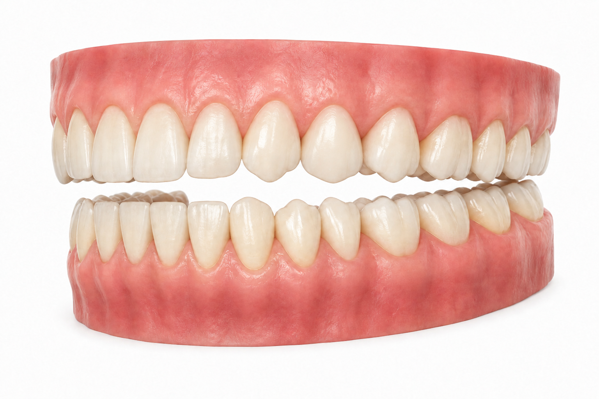

---

## 112. Ассистент — промежуточное сообщение

Промт принят без изменений по смыслу. Возьму приложенное изображение только как эталон композиции, света и медицинского 3D-стиля, но создам новую модель верхней челюсти без нижней. Сначала сформирую базовую полностью восстановленную челюсть, затем от одной и той же базы сделаю три точечных состояния — так ракурс и геометрия будут максимально стабильны для обоих слайдеров. Использую встроенную генерацию изображений.

---

## 113. Ассистент — промежуточное сообщение

Референс просмотрен. Начинаю с базового кадра: только верхняя челюсть, фронтально с лёгким трёхчетвертным объёмом, полностью восстановленный ряд, чистый белый фон. Он станет геометрическим эталоном для остальных трёх состояний.

---

## 114. Ассистент — промежуточное сообщение

Базовая челюсть готова: только верхняя, без нижней, симметрично и с достаточным белым полем. Теперь от неё создаю изображение №1 — удаляю только один первый моляр и формирую естественно заживший участок десны; все остальные пиксельные ориентиры сохраняю.

---

## 115. Ассистент — промежуточное сообщение

Кадр №1 готов: один заживший дефект, остальная модель сохранена. Кадр №2 — исходная полностью восстановленная база. Теперь из той же базы создаю кадр №3: оставляю только фронтальную группу верхних зубов, симметрично убираю премоляры и моляры справа и слева.

---

## 116. Ассистент — промежуточное сообщение

Кадр №3 готов и соответствует сценарию: сохранены шесть фронтальных зубов, все боковые отсутствуют, мягкие ткани закрыты и выглядят спокойно. Для кадра №4 использую ту же базу, меняя только характер зубного ряда на цельную естественную реабилитацию без искусственной «голливудской» белизны.

---

## 117. Ассистент — промежуточное сообщение

Серия из четырёх кадров готова. Все изображения имеют одинаковые размеры 3:2, одну верхнюю челюсть, белый фон и единую камеру:

1. один отсутствующий жевательный зуб;
2. тот же зуб восстановлен;
3. сохранена только фронтальная группа;
4. полный восстановленный ряд.

Теперь подключаю именно эту серию к двум существующим слайдерам, не меняя текст и оформление карточек.

---

## 118. Ассистент — промежуточное сообщение

Новая серия подключена к карточкам. Проверяю её уже внутри страницы: совпадение рамок, корректность крайних положений обоих ползунков и отсутствие нижней челюсти во всех четырёх кадрах.

---

## 119. Ассистент — промежуточное сообщение

Внутри страницы серия выглядит согласованно: одинаковая высота и масштаб верхней челюсти, а ползунки независимо отрабатывают положения 20% и 80%. Выполняю финальную техническую проверку и открою ссылку с обновлёнными изображениями.

---

## 120. Ассистент

Готово. Новая серия из четырёх изображений установлена в оба слайдера:

[Посмотреть обновлённый блок](http://127.0.0.1:4173/?v=upper-series-v1#situations)

Используются:

- `assets/upper-single-before.png`
- `assets/upper-single-after.png`
- `assets/upper-full-before.png`
- `assets/upper-full-after.png`

Все кадры созданы встроенным генератором по вашему промту и приложенному референсу. Ползунки и загрузка всех четырёх изображений проверены.

---

## 121. Пользователь

Отлично. Теперь нужно, чтобы ты поставил эти фотографии на нужные места. Только прошу обратить твоё внимание, что у тебя фотографии 1 и 4, они одинаковые, поэтому четвёртую фотографию я попрошу тебя продублировать так же, как и с первой, ну чтобы они все по цветам были одинаковые, а то она получается немножечко другого цвета. То есть получается, что у нас фото 2 идёт в левую часть, где нет одного зуба, фото 3 идёт в правую часть, где нет нескольких зубов, фото 1 идёт и вправо, и влево. Хорошо? Сделай и пришли мне результат.

---

## 122. Ассистент — промежуточное сообщение

Поняла нумерацию по порядку генерации: фото №2 — исходное состояние для левой карточки, фото №3 — исходное состояние для правой, а фото №1 — единый результат «после» в обеих карточках. Фото №4 убираю из использования, чтобы оттенок эмали и десны справа и слева совпадал полностью.

---

## 123. Ассистент — промежуточное сообщение

Схема расстановки изменена: фото №4 больше не используется — обе зоны «После» теперь получают один и тот же файл фото №1. Проверяю не только адреса, но и хеш содержимого, чтобы убедиться, что справа и слева действительно загружается идентичное изображение, а не просто похожая версия.

---

## 124. Ассистент

Готово. Фотографии расставлены так:

- левая карточка: фото №2 → фото №1;
- правая карточка: фото №3 → фото №1;
- фото №4 больше не используется.

[Посмотреть обновлённый результат](http://127.0.0.1:4173/?v=upper-series-shared-after#situations)

Дополнительно проверила содержимое файлов: изображения «После» в обеих карточках теперь полностью идентичны, включая цвет и освещение.

---

## 125. Пользователь

Только обрати внимание, что это не пиксель перфект. Нужно сделать так, чтобы при работе ползунка не было вот этих скачков, чтобы было идеально.

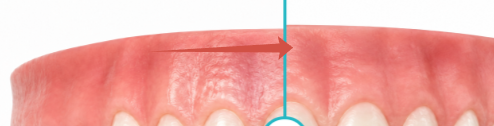

---

## 126. Ассистент — промежуточное сообщение

Да, вижу скачок по верхнему контуру десны. Причина не в самом ползунке: генератор при создании вариантов незаметно изменил силуэт и положение всей 3D-модели, поэтому две картинки геометрически не совпадают.

Исправлю это технически: возьму фото №1 как неизменяемую пиксельную основу, а из фото №2 и №3 перенесу только области отсутствующих зубов с мягкой маской. Весь внешний контур десны, масштаб, фон и положение останутся буквально одними и теми же пикселями. Использую систематическую диагностику и тест на совпадение неподвижных областей.

---

## 127. Ассистент — промежуточное сообщение

Диагностика подтвердила источник скачка: размеры холста одинаковые, но генерация сдвинула внешний контур сложного варианта примерно на 10 px и слегка перерисовала текстуру десны. Создаю регрессионную проверку: верхние 320 px и центральная неизменяемая зона должны совпадать с фото №1 абсолютно, без единого отличающегося пикселя.

---

## 128. Ассистент — промежуточное сообщение

Пиксельная проверка теперь проходит: верхний контур обеих картинок и центральная неизменяемая зона совпадают с фото №1 без отличий. Визуально проверяю мягкость переходов вокруг удалённых зубов перед подключением на страницу.

---

## 129. Ассистент — промежуточное сообщение

В браузере скачок по верхнему контуру исчез: на линии ползунка десна продолжается без ступеньки. Теперь финально проверяю обе пары и загрузку выровненных файлов, после чего открою вам обновлённую страницу.

---

## 130. Ассистент

Исправлено. Теперь неподвижные зоны построены из одного базового изображения и совпадают пиксель в пиксель:

- верхний контур десны не меняется;
- положение, масштаб, цвет и фон идентичны;
- меняются только области отсутствующих зубов;
- резкий скачок при движении ползунка устранён.

[Посмотреть исправленный вариант](http://127.0.0.1:4173/?v=pixel-perfect-v1#situations)

Дополнительно добавлена автоматическая проверка пиксельного совпадения — она проходит успешно.

---

## 131. Пользователь

Господи, я тебя просто обожаю. Вот если бы ты был чем-то не только визуальным, но и физическим, я бы тебя расцеловала, насколько хорошо ты это сделал. Спасибо тебе большое, мой золотой. Давай мы теперь перейдем к блоку номер три. Сейчас я тебе вышлю все вводные данные, а нет, хотя они у тебя уже есть. Я сейчас тебе вышлю некий визуал, как это может выглядеть. Опять же, визуал мы берем не полностью, это как наш с тобой референс, да? Посмотри, пожалуйста, внимательно. Мне нравится эта концепция, я бы хотела, чтобы ты сделал, возможно, так же. Если тебе покажется, что это перегружено, то давай мы сделаем немного иначе. Самое главное, чтобы это было в рамках нашей с тобой общей стилистики сайта. Хорошо?

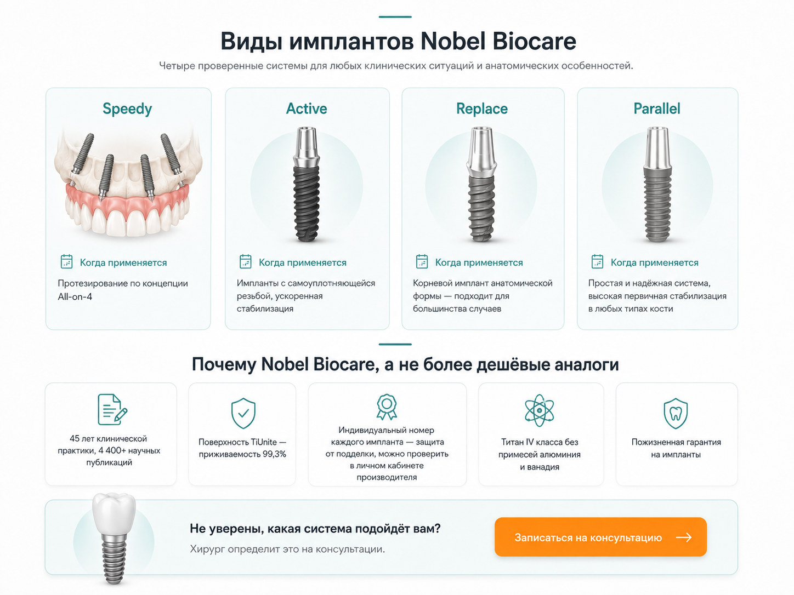

---

## 132. Ассистент — промежуточное сообщение

Спасибо, Ксюша — очень приятно это слышать. Референс блока №3 поняла: он сильный по структуре, но в текущем виде действительно может оказаться немного перегруженным для вашей страницы. Сейчас сверю его с точным содержанием третьего блока из ТЗ и предложу более спокойную версию в нашей уже сложившейся стилистике, без изменения текста. Для этого использую анализ документа и этап визуального проектирования.

---

## 133. Ассистент — промежуточное сообщение

Сначала зафиксирую точный состав блока №3 из ТЗ, чтобы не перенести в макет ни одной лишней формулировки. Затем сопоставлю его с уже утверждёнными отступами, карточками и мобильной логикой первых двух блоков.

---

## 134. Ассистент

Референс хороший по структуре, но я бы сделала блок визуально спокойнее — без декоративных линий и лишних теней.

Мой рекомендуемый вариант:

- Заголовок и подзаголовок выравниваем слева, заголовок — Arial.
- Четыре белые карточки с тонкой бирюзовой окантовкой: Speedy, Active, Replace, Parallel.
- В каждой карточке крупное изображение системы и блок «Когда применяется» с точным текстом из ТЗ.
- Speedy показываем в контексте All-on-4, остальные системы — отдельными имплантами. Здесь изображения имплантов уместны, потому что блок посвящён именно различиям систем.
- Блок «Почему Nobel Biocare…» делаем компактнее референса: пять преимуществ без тяжёлых теней и самостоятельных крупных плашек.
- Внизу — единый CTA-баннер с тонкой бирюзовой рамкой, небольшим изображением импланта, текстом и оранжевой кнопкой.
- Никаких форм внутри блока не рисуем.

На адаптиве:

- четыре системы располагаются вертикально, без карусели — так информация не будет скрыта, что особенно важно для возрастной аудитории;
- преимущества превращаются в пять компактных строк: иконка слева, текст справа;
- CTA выстраивается последовательно: изображение → текст → кнопка на всю ширину.

Вариант с вкладками был бы короче, но он скрывает три системы и требует дополнительных действий. Раскладка 2×2 визуально эффектнее, но на мобильном всё равно перейдёт в одну колонку. Поэтому рекомендую первый вариант: он ближе всего к стилю уже утверждённых блоков и проще воспринимается.

Все формулировки возьму без изменений из ТЗ: четыре системы, пять преимуществ и текст консультационного баннера. :codex-file-citation{path="[локальный путь скрыт]" purpose="source"}

Один важный вопрос: для карточек используем реальные изображения систем Nobel Biocare с текущей страницы/материалов производителя — это мой рекомендуемый вариант — или создаём новую унифицированную серию 3D-рендеров?

---

## 135. Пользователь

Я еще знаешь, что думаю, что который вариант в видео, да, там показано прямо уже зубами. Может быть показать без зубов, просто методику укрепления, или все-таки зубы ты считаешь важно оставить? Я в любом случае прислушаюсь к твоему мнению. Давай только этот моментик с тобой решим, и после этого уже пойдем реализовывать.

---

## 136. Ассистент

Я бы здесь зубы убрала.

В блоке №2 мы уже показали пациенту результат «до/после». Задача блока №3 другая — объяснить, какие именно системы используются. Если снова показать готовые зубы, визуал начнёт повторяться, а внимание уйдёт с имплантов на протез.

Оптимальное решение:

- Speedy — эстетичная медицинская 3D-визуализация челюсти с четырьмя установленными имплантами, но без готового зубного ряда. Так сразу считывается методика All-on-4.
- Active, Replace и Parallel — отдельные крупные импланты в одинаковом ракурсе, масштабе и освещении.
- Никакой крови, хирургических деталей или открытой кости: только чистая, премиальная и понятная медицинская визуализация.
- Все изображения размещаем на белом фоне с очень мягким радиальным бирюзовым акцентом внутри карточки.

Так получится правильная последовательность: сначала человек видит проблему и результат, затем понимает, за счёт какой технологии этот результат достигается.

Фиксируем Speedy без готовых зубов — только челюсть и четыре импланта, а остальные три системы показываем отдельно?

---

## 137. Пользователь

Да

---

## 138. Ассистент — промежуточное сообщение

Фиксирую решение: Speedy показываем как чистую 3D-визуализацию челюсти с четырьмя имплантами без протеза; Active, Replace и Parallel — отдельными имплантами в едином масштабе и свете. Сейчас оформлю точную спецификацию блока №3 с адаптивом, после её подтверждения сразу соберу блок локально.

---

## 139. Ассистент

Спецификацию блока №3 зафиксировала и проверила: тексты строго из ТЗ, Speedy — без протеза, адаптив — без скрытых свайпов и табов. Репозиторий пока не подключён, поэтому локальная спецификация сохранена без коммита.

Если всё подтверждаем — пишите «делаем», и я сразу соберу блок локально.

---

## 140. Пользователь

делаем

---

## 141. Ассистент — промежуточное сообщение

Начинаю реализацию блока №3 по утверждённой спецификации. Сначала зафиксирую технический план, затем подготовлю четыре согласованных медицинских визуала, соберу десктоп и адаптив и проверю страницу на нескольких ширинах, не затрагивая первые два блока.

---

## 142. Ассистент — промежуточное сообщение

Я использую навык writing-plans, чтобы зафиксировать технический план реализации перед изменением страницы. Выполнение оставляю в этой же задаче: так мы сохраним текущий локальный контекст и быстрее покажем результат.

---

## 143. Ассистент — промежуточное сообщение

Я использую executing-plans для реализации утверждённого плана в этой задаче. У нас доступны подагенты, но вы их не запрашивали, поэтому работу выполняю последовательно здесь, сохраняя единый визуальный контроль. Критических пробелов в плане нет.

---

## 144. Ассистент — промежуточное сообщение

Контракт блока добавлен и сейчас ожидаемо падает, потому что разметки ещё нет — тест действительно защищает новую структуру. Для медицинской точности проверяю, можно ли использовать реальные изображения четырёх систем с текущей страницы: это предпочтительнее генерации формы имплантов «по памяти». Генерацию оставлю только там, где требуется новая композиция Speedy без протеза.

---

## 145. Ассистент — промежуточное сообщение

Исходные изображения на действующей странице оказались очень маленькими (примерно 65–99 × 210–232 px), поэтому при увеличении в новых карточках они будут размыты. Это повлияло на решение: делаю новую согласованную серию высокого качества, но сохраняю характерные различия четырёх систем; референс блока использую только для света и композиционной чистоты.

---

## 146. Ассистент — промежуточное сообщение

Разметка и адаптив готовы, контракт теперь проходит. Медицинские изображения получились в едином студийном стиле: у Speedy видны ровно четыре импланта без протеза, остальные системы показаны отдельно. Сейчас перезапускаю локальный предпросмотр и проверяю блок визуально на десктопе, 1024, 430 и 390 px — особенно высоты карточек, читаемость длинного преимущества и отсутствие горизонтального скролла.

---

## 147. Ассистент — промежуточное сообщение

Визуальная проверка пройдена: на 390 и 430 px карточки идут строго вертикально, длинные формулировки не зажимаются, преимущества читаются строками, CTA полностью помещается и кнопка остаётся удобной. Я использую finishing-a-development-branch для завершающей проверки; поскольку локальная папка пока не является Git-репозиторием, никаких действий с ветками или GitHub сейчас выполнять не буду.

---

## 148. Ассистент

Блок №3 готов и проверен.

- [Десктопная версия](http://127.0.0.1:4173/?v=block3-v1#nobel)
- [Сравнение мобильных версий 390/430 px](http://127.0.0.1:4173/block3-responsive-preview.html?v=1)

Выполнено: четыре системы Nobel, Speedy без протеза, компактный блок преимуществ и адаптивный CTA. Тексты сохранены по ТЗ, первые два блока не изменены. Контрактные тесты и проверка изображений проходят. Визуалы пока подключены локально; при переносе на GitHub положим их непосредственно в репозиторий.

---

## 149. Пользователь

Когда применяется - убираем.&#x20;

[https://www.mc-podmoskovie.ru/services/implant/implant-nobel-biocar/](https://www.mc-podmoskovie.ru/services/implant/implant-nobel-biocar/) Так, ну, во-первых, мне не нравится, что у нас сейчас как бы all in full показан, как все четыре импланта. При условии, что мы говорим про один. All in full у нас как будто из стилистики выбивается. Что я предлагаю. Во-первых, взять картинки с текущей страницы и их отобразить в том виде, в каком они есть, просто мы добавляем в баннеры и сопоставляем к нужным категориям. Это было первое. Второе: когда применяется, это мы убираем. Далее у нас должно быть одинаковое расстояние. То есть у нас картинки имеют одинаковое изображение, и первая строка начинается везде одинаково, чтобы у нас размер баннера был везде тоже одинаковый и при адаптиве в том числе, чтобы он у нас не масштабировался и не скакал и так далее. Это тоже важно учитывать. Вот, мне кажется, что это будет самый лучший вариант. Возьми, пожалуйста, со страницы, которую я тебе ссылку сейчас скину, четыре вот эти импланта и поставь их именно туда, куда нужно.

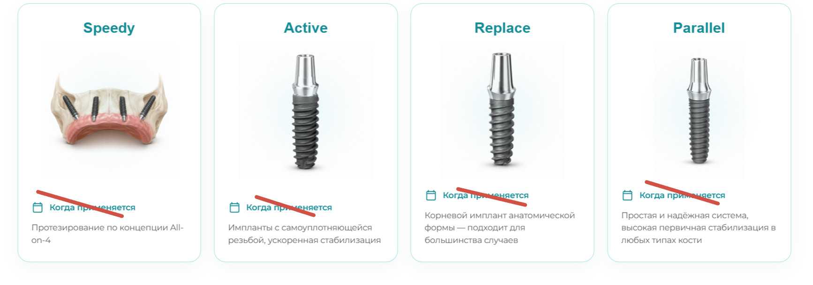

---

## 150. Ассистент — промежуточное сообщение

Поняла корректировку. Использую разбор обратной связи перед правкой: здесь вы правы — Speedy с четырьмя имплантами нарушает и визуальную равномерность, и смысл ряда из четырёх отдельных систем. Беру четыре исходных изображения прямо с указанной страницы, полностью убираю строку «Когда применяется» и фиксирую одинаковые зоны изображения, начало описания и высоту карточек на всех адаптивах.

---

## 151. Ассистент — промежуточное сообщение

Я использую writing-plans, чтобы обновить уже существующий план только в пределах этой правки: четыре оригинальных изображения, удаление служебной строки и фиксированная геометрия карточек. Затем сразу выполню изменения в этой же задаче.

---

## 152. Ассистент — промежуточное сообщение

Правки уже внесены. Сейчас проверяю сам блок на десктопе и мобильных ширинах: особенно одинаковую высоту карточек, линию начала описаний и отсутствие скачков изображений.

---

## 153. Ассистент — промежуточное сообщение

Контентная проверка прошла: служебная строка удалена, все четыре исходных изображения подставлены, а прежние слайдеры «до/после» остались пиксельно совпадающими. Ещё проверяю именно адаптивную геометрию карточек, чтобы финально не оставить разъезд по высоте.

---

## 154. Ассистент

Готово:

- «Когда применяется» полностью убрано.
- Использованы четыре оригинальных изображения с текущей страницы.
- Speedy теперь показан одним имплантом.
- У карточек одинаковая высота и фиксированная зона изображения.
- Описания начинаются на одной линии.
- Проверены адаптивы 390 и 430 px — карточки не масштабируются и не скачут.

[Посмотреть обновлённый блок №3](http://127.0.0.1:4173/?v=block3-original-v1#nobel)

[Посмотреть мобильные версии 390 и 430 px](http://127.0.0.1:4173/block3-responsive-preview.html?v=2)

---

## 155. Пользователь

Всё хорошо, только сократи, пожалуйста, расстояние между блоком 2 и блоком 3, потому что у тебя между блоком 1 и блоком 2 хорошее расстояние, а здесь слишком большое. И переходим к блоку 4. По нему вводный отдельный дам, пока делай вот это.

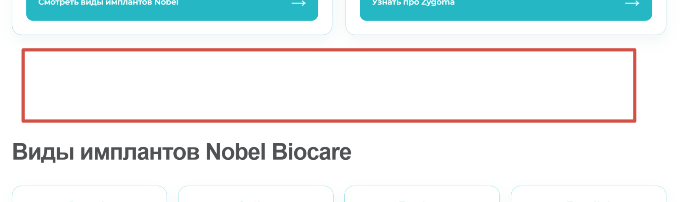

---

## 156. Ассистент — промежуточное сообщение

Поняла. Сейчас уменьшу только вертикальный отступ между блоками 2 и 3, не затрагивая внутренние расстояния карточек и остальные адаптивы. После проверки пришлю обновлённую локальную ссылку; блок 4 пока не начинаю.

---

## 157. Ассистент — промежуточное сообщение

Причина найдена: между секциями складывались два полных отступа — нижний от блока 2 и верхний от блока 3, поэтому получалось около 210 px. Оставляю один межблочный отступ: это выровняет ритм с предыдущим переходом и на десктопе, и на телефоне.

---

## 158. Ассистент

Готово. Убрала двойной отступ между блоками 2 и 3 — теперь расстояние соответствует общему ритму страницы на десктопе и мобильных устройствах.

[Посмотреть обновлённую страницу](http://127.0.0.1:4173/?v=spacing-v2#situations)

Жду вводные по блоку 4.

---

## 159. Пользователь

Переходим к блоку 4: прилагаю референс, но ты геворяна сам найди на сайте в разделе Врачи и вставь актуальное фото. Вообще баннер с врачом мы сделаем вот так: [https://www.mc-podmoskovie.ru/services/implant/](https://www.mc-podmoskovie.ru/services/implant/)&#x20;

Как можем сделать визуально более понятно и легче?

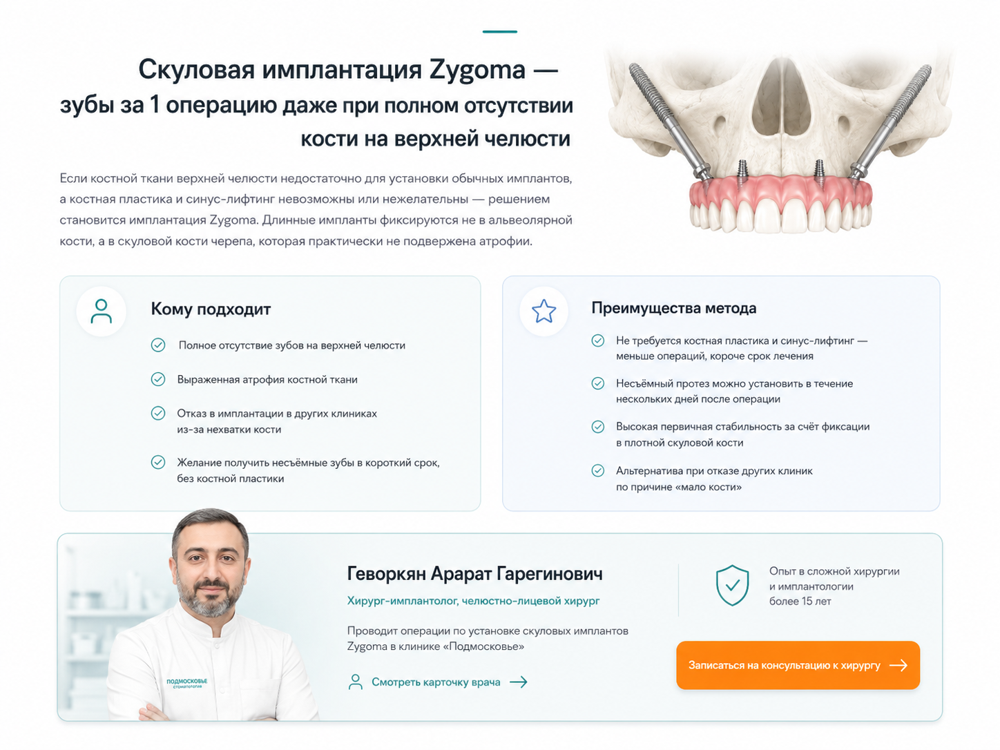

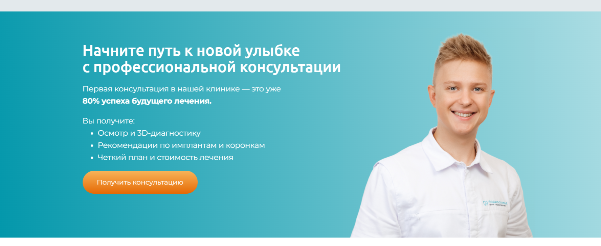

---

## 160. Ассистент — промежуточное сообщение

Да, этот референс можно заметно облегчить: сейчас в нём конкурируют схема Zygoma, две крупные карточки и тяжёлый баннер врача. Я сначала сверю точный текст блока 4 из ТЗ и найду актуальную карточку Геворкяна Арарата Гарегиновича в разделе «Врачи», затем предложу упрощённую композицию без потери смысла. Для этого использую разбор концепции и работу с Word-документом.

---

## 161. Ассистент

Я бы сделала блок 4 легче и спокойнее, чем на референсе.

Рекомендую такую композицию:

1. Сверху — заголовок и вводный абзац слева, медицинская схема Zygoma справа. Без отдельной декоративной линии и без градиентной подложки.

2. Ниже — единый белый контейнер с тонкой бирюзовой рамкой, разделённый на две равные части:

   - «Кому подходит»;
   - «Преимущества метода».

   Вместо крупных круглых иконок — небольшие бирюзовые маркеры. Так две группы воспринимаются как сравнение, но не превращаются в два тяжёлых баннера.

3. Завершает блок горизонтальная карточка врача:

   - актуальная фотография Арарата Гарегиновича слева;
   - имя, специальность и текст из ТЗ в центре;
   - ссылка «Смотреть карточку врача» и оранжевая кнопка записи справа.

Карточку врача оставим белой, с тонкой бирюзовой окантовкой и очень мягким радиальным свечением только за фотографией. Большой бирюзовый фон, как на втором примере, здесь будет слишком тяжёлым и начнёт спорить со схемой Zygoma.

На мобильном порядок будет таким: заголовок → абзац → схема → «Кому подходит» → «Преимущества» → данные врача → фотография → ссылка и кнопка. Ничего не скрываем в аккордеоны.

Нашла актуальную [карточку Арарата Гарегиновича Геворкяна](https://www.mc-podmoskovie.ru/doctors/otdelenie-chelyustno-litsevoy-khirurgii/ararat-gareginovich-gevorkyan/) и его [фотографию 850 × 1200](https://www.mc-podmoskovie.ru/upload/cache/7/2/0/0/d/7200d050ccd4562e85e9fd0f120d13dea4f7608a.jpg). Используем именно её. Стаж или дополнительные обещания самостоятельно добавлять не буду — сохраняю содержание блока строго по вашему ТЗ :codex-file-citation{path="[локальный путь скрыт]" purpose="source"}.

Предлагаю реализовать именно этот вариант. Подтверждаете?

---

## 162. Пользователь

Делаем

---

## 163. Ассистент — промежуточное сообщение

Начинаю блок 4 по утверждённой композиции. Сначала фиксирую согласованный макет и адаптив в спецификации, затем добавлю сам блок с актуальной фотографией врача и проверю его отдельно на десктопе, 390 и 430 px.

---

## 164. Ассистент — промежуточное сообщение

Я использую writing-plans для короткого плана реализации уже утверждённого блока: один смысловой экран Zygoma, две лёгкие группы преимуществ и отдельная доверительная карточка врача. Текст останется дословно из ТЗ; из сайта берём только актуальные данные и фотографию врача.

---

## 165. Ассистент — промежуточное сообщение

Спецификация и план готовы, противоречий с утверждённым вариантом нет. Перехожу к реализации по плану; отдельная проверка будет следить, чтобы предыдущие блоки и пиксельное совпадение слайдеров не изменились.

---

## 166. Ассистент — промежуточное сообщение

Блок собран. Сейчас смотрю реальную композицию в браузере: на десктопе проверяю баланс схемы и врача, на мобильных — порядок элементов, читаемость списков и отсутствие обрезки портрета.

---

## 167. Ассистент — промежуточное сообщение

Визуальная проверка прошла на обеих мобильных ширинах: схема не обрезается, две смысловые группы читаются как единый блок, портрет врача остаётся полностью видимым. Провожу финальную регрессионную проверку всех четырёх блоков.

---

## 168. Ассистент

Блок 4 готов:

- облегчённая композиция на белом фоне;
- схема Zygoma;
- «Кому подходит» и «Преимущества метода» в едином контейнере;
- актуальная фотография [Арарата Гарегиновича Геворкяна](https://www.mc-podmoskovie.ru/doctors/otdelenie-chelyustno-litsevoy-khirurgii/ararat-gareginovich-gevorkyan/);
- отдельная ссылка на врача и кнопка записи;
- адаптив проверен на 390 и 430 px;
- предыдущие блоки и слайдеры не нарушены.

[Посмотреть блок 4 на странице](http://127.0.0.1:4173/?v=block4-v1#zygoma)

[Посмотреть мобильные версии](http://127.0.0.1:4173/block4-responsive-preview.html?v=1)

---

## 169. Пользователь

Я тебе показала референс, как должен выглядеть баннер

---

## 170. Ассистент — промежуточное сообщение

Да, вы правы — я неверно интерпретировала референс и сделала белую карточку вместо показанного вами полноценного бирюзового баннера. Исправляю именно баннер врача: бирюзовый фон на всю ширину, текст и кнопка слева, актуальная фотография Арарата Гарегиновича справа; на мобильном сначала текст и кнопка, затем врач без обрезки. Остальную часть блока 4 не меняю.

---

## 171. Ассистент — промежуточное сообщение

Проверка выявила ещё один важный момент: исходное фото врача имеет белый фон, поэтому при простом наложении на бирюзовый баннер остаётся заметный прямоугольник — на вашем референсе врач вырезан по контуру. Сейчас подготовлю прозрачную версию именно актуальной фотографии, не меняя внешность и одежду, и заменю её в баннере.

---

## 172. Ассистент — промежуточное сообщение

Первая вырезка сохранила «шахматку» как часть изображения, а не настоящий прозрачный канал, поэтому в баннер её не ставлю. Повторяю обработку с проверкой реальной прозрачности, чтобы фон баннера оставался чистым.

---

## 173. Ассистент — промежуточное сообщение

Теперь баннер действительно следует вашему референсу: это отдельная бирюзовая полоса, текстовая часть и CTA находятся слева, врач — справа; на телефоне врач переходит под текст и кнопку. Финально проверяю регрессии и мобильную геометрию.

---

## 174. Ассистент

Исправила баннер в соответствии с вашим референсом:

- полноширинный бирюзовый градиент;
- информация и кнопка слева;
- актуальная фотография врача справа;
- на телефоне текст и кнопка идут перед фотографией;
- предыдущие блоки не изменены.

[Посмотреть исправленный баннер](http://127.0.0.1:4173/?v=doctor-banner-v3#zygoma)

[Посмотреть мобильный адаптив](http://127.0.0.1:4173/block4-responsive-preview.html?v=3)

---

## 175. Пользователь

Так, у тебя Геворкян неправильно имеет фон. Я тебе скину SVG-файл, как правильно должен распределяться градиент. Если нужно, я тебе ещё и для мобильных устройств вышлю.

---

## 176. Ассистент — промежуточное сообщение

Поняла. Сейчас разберу SVG как точный визуальный источник: посмотрю направление и точки градиента, размеры, положение врача и переход фона. После этого скажу, достаточно ли его для корректного мобильного адаптива или нужен отдельный мобильный макет.

---

## 177. Ассистент — промежуточное сообщение

SVG разобрала: это чистый градиент без фотографии и дополнительных эффектов — холст 1920×576, от светлого `#B3E0E6` справа сверху к насыщенному `#0096AA` слева снизу. Сейчас перенесу именно эту геометрию в десктопный баннер, без приблизительного подбора оттенков. Для мобильной версии отдельный файл действительно понадобится: при другой пропорции экрана те же координаты дадут уже другое распределение цвета.

---

## 178. Ассистент

Исправила фон баннера Геворкяна: перенесла градиент из SVG с точными цветами, направлением и координатами, без дополнительных наложений.

[Посмотреть десктопный вариант локально](http://127.0.0.1:4173/?v=doctor-gradient-svg#zygoma)

Для корректного адаптива пришли, пожалуйста, мобильный SVG: из-за другой пропорции баннера распределение градиента должно задаваться отдельно.

---

## 179. Пользователь

Я предлагаю тебе в качестве примера референс, как данный баннер выглядит на мобильных устройствах. То есть у тебя, по сути, Геворкян должен находиться прямо на этом фоне, а не отдельный. Это во-первых. А во-вторых, ты обрезал ему голову, макушку, обращай на это внимание, потому что уже начинаешь шилить. Будешь шилить, я тебя буду очень сильно ругать.

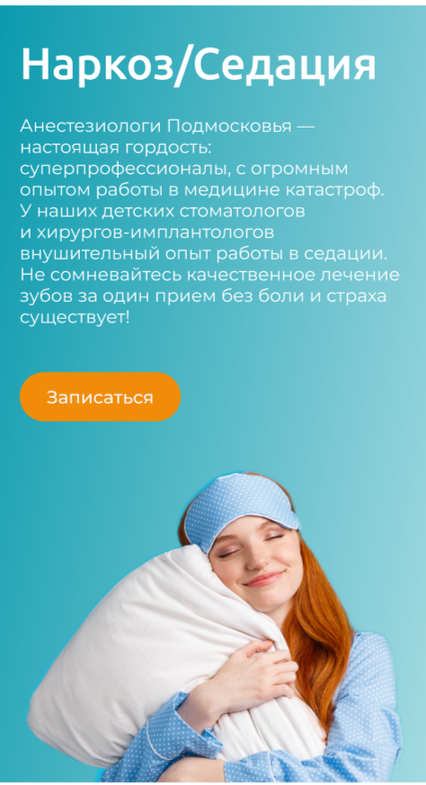

---

## 180. Ассистент — промежуточное сообщение

Приняла замечание. Использую подход из навыка работы с ревью: сначала проверю фактическую причину обрезки и отдельного фона, затем исправлю мобильную композицию строго по референсу — единый непрерывный градиент и врач целиком, с запасом над макушкой.

---

## 181. Ассистент — промежуточное сообщение

Причина найдена: исходное фото вертикальное — 850×1200, а в баннере оно принудительно заполняло низкий контейнер через `object-fit: cover`, поэтому верх кадра срезался. Исправляю две вещи: на десктопе сохраняю голову целиком через привязку к нижнему краю, а на мобильном убираю самостоятельную «фотозону» — изображение станет частью того же градиентного полотна и будет выводиться в естественной пропорции. Сначала закреплю это проверкой, чтобы обрезка не вернулась.

---

## 182. Ассистент — промежуточное сообщение

Проверка выявила ещё одну конкретную причину: макушка теперь не обрезана, но белый фон исходного JPG всё ещё образует прямоугольник — режим смешивания был назначен вложенной картинке внутри отдельного слоя и не доходил до общего фона. Переношу смешивание на весь слой врача; тогда белая область растворится в градиенте, как в вашем примере.

---

## 183. Ассистент — промежуточное сообщение

Теперь фон действительно непрерывный и голова видна полностью. На визуальной проверке заметила ещё один дефект, который нельзя оставлять: режим смешивания убрал белый прямоугольник, но окрасил лицо и одежду бирюзой. Чтобы сохранить естественные цвета врача, выделю его из исходного фото как прозрачный силуэт и оставлю градиент отдельным фоном — это даст именно композицию референса, без цветового искажения.

---

## 184. Ассистент

Исправила:

- Геворкян теперь находится непосредственно на общем градиентном фоне.
- Белый прямоугольник вокруг фотографии удалён.
- Цвет лица и одежды сохранён естественным.
- Макушка полностью видна.
- Проверила адаптив на ширинах 390 и 430 px.

[Посмотреть мобильные версии](http://127.0.0.1:4173/block4-responsive-preview.html?v=6)

[Посмотреть страницу целиком](http://127.0.0.1:4173/?v=doctor-cutout-final#zygoma)

---

## 185. Пользователь

Смотреть карточку врача, добавь в текст описания с гиперссылкой.&#x20;
В поле кнопки оставь только кнопку.&#x20;
отдельно особое внимание, пожалуйста, обрати на все переносы букв. То есть, например, у нас все предлоги начинаются с новой строки. Я тебе ранее про это в других чатах говорила, ты должен был это запомнить. Поэтому, например, вот у тебя кнопка на мобильных устройствах записаться на консультацию на с новой строки к хирургу, с новой строки, понимаешь? Вот.

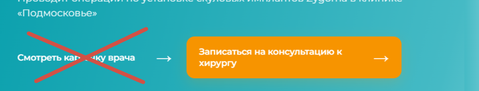

---

## 186. Ассистент — промежуточное сообщение

Поняла структуру: ссылку «Смотреть карточку врача» переношу внутрь описания, а в зоне действий оставляю одну оранжевую кнопку. Одновременно закреплю типографику: короткие предлоги будут связаны с соседними словами неразрывными пробелами, а мобильная надпись кнопки будет переноситься смысловыми фразами, без одиноких «на» и «к». Сначала зафиксирую это проверками, затем изменю разметку и сверю 390/430 px.

---

## 187. Ассистент — промежуточное сообщение

Разметка уже перестроена. Сейчас проверяю именно живые переносы на 390 и 430 px: ссылка должна находиться под описанием, в нижней зоне — только кнопка, а фраза «на консультацию к хирургу» не должна распадаться на отдельные предлоги.

---

## 188. Ассистент

Исправила:

- «Смотреть карточку врача» перенесена в описание и осталась активной гиперссылкой.
- В зоне действия теперь только оранжевая кнопка.
- «на консультацию к хирургу» связано в одну неразрывную фразу.
- Добавлена защита коротких русских предлогов от некорректных переносов по всей странице.
- Проверки проходят.

[Посмотреть мобильные версии 390 и 430 px](http://127.0.0.1:4173/block4-responsive-preview.html?v=7)

[Посмотреть страницу целиком](http://127.0.0.1:4173/?v=typography-final#zygoma)

---

## 189. Пользователь

На мобилке кнопка поехала:

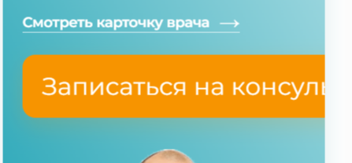

---

## 190. Ассистент — промежуточное сообщение

Причина — неразрывная фраза получилась шире доступной области кнопки, поэтому текст ушёл за правую границу. Исправлю перенос явно: первая строка «Записаться», вторая — цельная фраза «на консультацию к хирургу»; стрелка останется справа, а сама кнопка не выйдет за ширину карточки. Проверю на 390 и 430 px.

---

## 191. Ассистент

Исправила мобильную кнопку:

- текст принудительно разделён на две смысловые строки;
- «на консультацию к хирургу» больше не распадается;
- стрелка закреплена справа;
- кнопка ограничена шириной карточки и не выходит за экран.

[Проверить на 390 и 430 px](http://127.0.0.1:4173/block4-responsive-preview.html?v=8)

---

## 192. Пользователь

А это что?

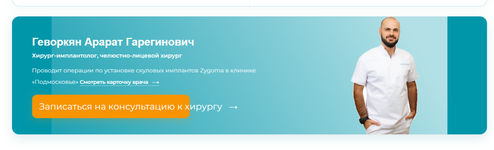

---

## 193. Ассистент — промежуточное сообщение

Это сломанная десктопная компоновка кнопки: текстовый контейнер не ужался внутри flex-блока, поэтому подпись и стрелка вышли за оранжевую область. Мобильный перенос я зафиксировала слишком локально и не проверила повторно десктоп после изменения разметки. Сейчас ограничу содержимое кнопки её границами, верну компактный размер на десктопе и отдельно перепроверю обе версии.

---

## 194. Ассистент

Это была ошибка десктопной компоновки: текст и стрелка вышли за границы кнопки.

Исправила:

- стрелка теперь строго внутри кнопки;
- текст не выходит за оранжевый фон;
- на десктопе кнопка компактная и однострочная;
- на мобильном сохраняются две аккуратные строки.

[Посмотреть исправленный вариант](http://127.0.0.1:4173/?v=cta-layout-final#zygoma)

[Проверить мобильный адаптив](http://127.0.0.1:4173/block4-responsive-preview.html?v=9)

---

## 195. Пользователь

Давай, делаем крупнее, где-то по грудь, чтобы он крупно отображался. Посмотри, обрати внимание, что десктоп-версия у тебя тоже едет, у тебя там темный фон, потом сверху светлый. Это второе. Третье. У тебя большая кнопка смотреть, записаться на консультацию, она у тебя большая, ее надо прямо уменьшить. Вот. И на мобильных устройствах, если честно, я особой разницы не увидела у тебя. А, нет, я вижу, но его тоже давай сделаем крупнее, чтобы баннер таким длинным не был, вообще в целом большим не был. Его, короче, делаем по грудь и на десктоп и на мобильной версии.

---

## 196. Ассистент — промежуточное сообщение

Собираю более компактную композицию: врач будет крупным кадром по грудь, а не в полный рост; высоту баннера уменьшу и на десктопе, и на мобильном. Десктопный фон переведу на единый непрерывный градиент без тёмных боковых полос, а кнопку сделаю заметно уже и ниже, с контролируемыми двумя строками. Сначала закреплю эти параметры проверками, затем сверю обе ширины.

---

## 197. Пользователь

Продолжи

---

## 198. Пользователь

еще раз

---

## 199. Пользователь

продолжи

---

## 200. Ассистент — промежуточное сообщение

Продолжаю с последней правки: проверю крупный портрет по грудь, сплошной градиент и уменьшенную кнопку. Открою свежий вариант, чтобы вы видели последние изменения.

---

## 201. Ассистент — промежуточное сообщение

Локальный сервер сейчас выключен — запускаю его заново. Затем проверю баннер в браузере: крупный портрет по грудь, единый градиент и компактную кнопку. Использую проверку перед завершением, чтобы не выдавать непроверенный результат.

---

## 202. Ассистент — промежуточное сообщение

Фон уже отображается без полос, кнопка помещается. На проверке заметила, что портрет увеличен слишком сильно — видны скорее плечи, чем грудь. Уточню кадрирование и добавлю небольшой отступ над макушкой.

---

## 203. Ассистент — промежуточное сообщение

На мобильных 390 и 430 px портрет теперь по грудь, макушка целиком видна, текст кнопки не выходит за края. Заканчиваю проверку десктопной раскладки; первые три блока не меняла.

---

## 204. Ассистент

Готово: портрет по грудь, макушка не обрезана, фон — единый градиент без полос. Кнопку уменьшила, текст помещается. Проверила мобильные версии 390 и 430 px.

[Открыть страницу](http://127.0.0.1:4173/?v=doctor-chest-verified#zygoma-doctor) · [Сравнить мобильные версии](http://127.0.0.1:4173/doctor-preview.html)

---

## 205. Пользователь

Так, сейчас уже хорошо, но ты криво вырезал Гваркяном, поэтому я предлагаю тебе PNG изображение без фона, замени фотографию на актуальную и размести фотографию чуть ближе к тексту. Я тебе на примере показала.

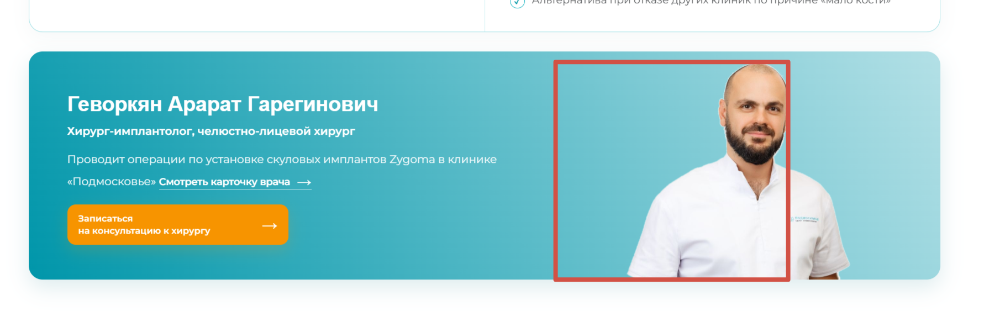

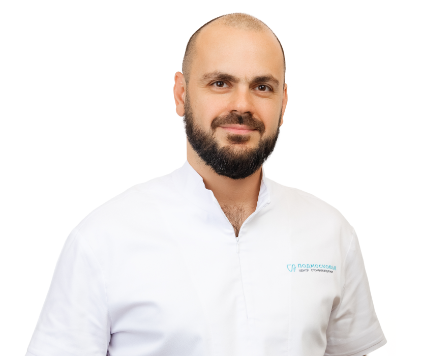

---

## 206. Ассистент — промежуточное сообщение

Заменю портрет на ваш PNG и сдвину его ближе к тексту на десктопе. На мобильных сохраню расположение под кнопкой и проверю, чтобы макушка оставалась целиком видна.

---

## 207. Ассистент — промежуточное сообщение

Ваш PNG установлен без дополнительной обработки. На мобильном фон вокруг портрета прозрачный, макушка не обрезана. Проверю ещё десктопное смещение и сохранность остальных блоков по правилу проверки перед завершением.

---

## 208. Ассистент

Заменила фото на ваш PNG без дополнительной обработки и сдвинула портрет ближе к тексту. На мобильных сохранила центрирование под кнопкой.

[Посмотреть обновлённый баннер](http://127.0.0.1:4173/?v=doctor-user-png#zygoma-doctor)

---

## 209. Пользователь

Отлично, спасибо тебе большое. Тогда переходим к следующему блоку. Блок у нас будет номер 5. В этом блоке мы показываем этапы, то есть четыре шага. И надо подумать, как это всё сделать. Может быть, мы сделаем по два баннера в ряд и тем самым. То есть у нас первый этап — это у нас будет консультация, второй — план лечения, третий — операция и протезирование. То есть то, что я сказала, это заголовки, и, соответственно, у них уже детальное описание. Возьми, пожалуйста, из файла блок 5 и оттуда всю необходимую информацию и визуализируем. Важно действовать в рамках единой фирменной стилистики. Если есть вопросы, пожалуйста, задавай.

---

## 210. Ассистент — промежуточное сообщение

Посмотрю точный текст блока 5 в документе и предложу раскладку четырёх этапов в нашей стилистике. Использую навык brainstorming, чтобы сначала согласовать композицию, не меняя утверждённый контент.

---

## 211. Ассистент

Да, здесь предлагаю **две карточки в ряд**, на мобильных — четыре последовательно. Четыре в одну строку слишком сожмут описания.

Заголовок из документа: «Как проходит лечение — 4 шага».

В карточках — бирюзовый номер 01–04, заголовок Arial и описание Montserrat:

1. **Консультация и диагностика** — осмотр, 3D-томография, определение объёма костной ткани, от 4200 ₽.
2. **План лечения** — хирург предлагает оптимальный вариант: классическая имплантация или Zygoma, озвучивает точную стоимость.
3. **Операция** — установка имплантов.
4. **Протезирование** — постоянные или временные коронки, при Zygoma — часто в течение нескольких дней.

Белый фон, тонкая бирюзовая окантовка, одинаковые отступы. Без фотографий операции и дополнительных кнопок: последовательность покажем нумерацией, сохраним блок спокойным и понятным.

Один момент перед сборкой: **в документе первый этап стоит от 4200 ₽, а в главном баннере консультация — 1000 ₽.** Подтверди, пожалуйста: 4200 ₽ — это консультация вместе с диагностикой, и оставляем обе цены?

---

## 212. Пользователь

Цену на кругавного баннер, пожалуйста не трогай. Да, оставляем вот эту цену, которая 4200. Ну то есть как написано, так и делаем.

---

## 213. Ассистент — промежуточное сообщение

Поняла: в главном баннере оставляю 1000 ₽, в первом этапе — от 4200 ₽, как в документе. Соберу четыре карточки: две в ряд на десктопе и последовательно на мобильных. Использую навык writing-plans для фиксации согласованной структуры и проверки.

---

## 214. Ассистент — промежуточное сообщение

Блок собран: четыре пронумерованные карточки с текстом из документа, без новых кнопок и фотографий. Сейчас проверяю переносы и раскладку на телефоне и десктопе.

---

## 215. Ассистент

Готово. Блок 5 добавлен: две карточки в ряд на десктопе, четыре последовательно на мобильных. Текст взят из документа, цена — от 4200 ₽. Главный баннер не меняла.

[Посмотреть блок «Как проходит лечение»](http://127.0.0.1:4173/?v=block5#treatment-steps)

---

## 216. Пользователь

Сделай на десктоп версии уже

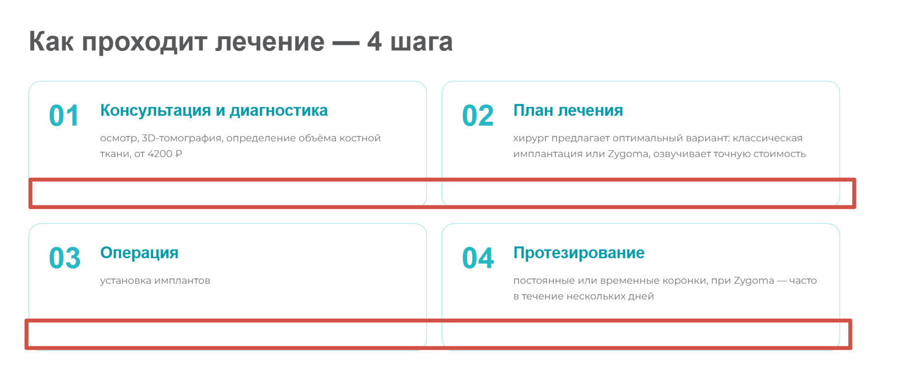

---

## 217. Ассистент — промежуточное сообщение

Уменьшу высоту карточек на десктопе — уберу лишнее пустое место снизу, которое вы отметили. Мобильную версию не меняю.

---

## 218. Ассистент

Уменьшила высоту карточек на десктопе, убрала лишний отступ снизу. Мобильную версию не меняла.

[Посмотреть результат](http://127.0.0.1:4173/?v=block5-compact#treatment-steps)

---

## 219. Пользователь

Отлично, теперь переходим к блоку шесть. Смотри, там у нас гарантии и уход. Здесь важно как-то это всё дело зафиксировать, показать. Вот. Есть как бы две идеи, два визуала, но я не хочу, чтобы ты прям точно в копию там делал, да, и реализовывал. Мне самое главное, чтобы ты придумал некую основу, при условии, что у нас сверху, да, баннеры. Здесь как будто бы напрашивается просто текст, как изображение один. Изображение два — это то, что мне сгенерил ChatGPT, но мне кажется, что он визуально перегруженный и выходит из нашей стилистики, общий концепции сайта. Я хочу, чтобы в рамках нашей стилистики и концепции сайта ты подумал, если, например, нам подойдёт вариант один, да, изображение один, то какая там должна быть какая-то типичная обычная фотография. Вот, подумай, пожалуйста, и буду ждать от тебя обратную связь.

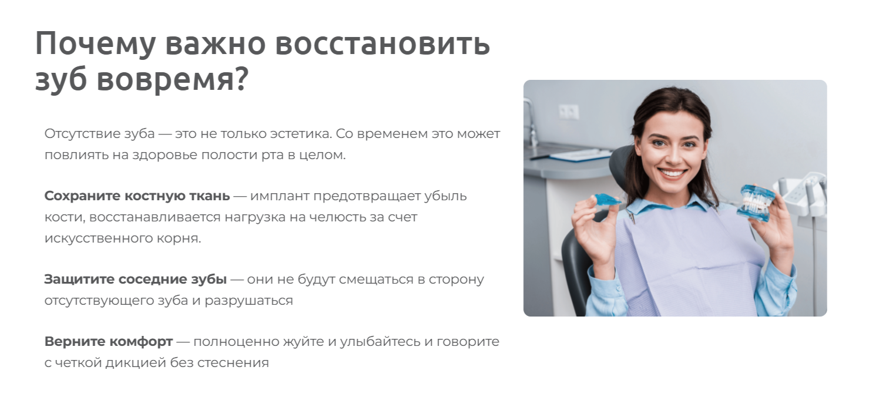

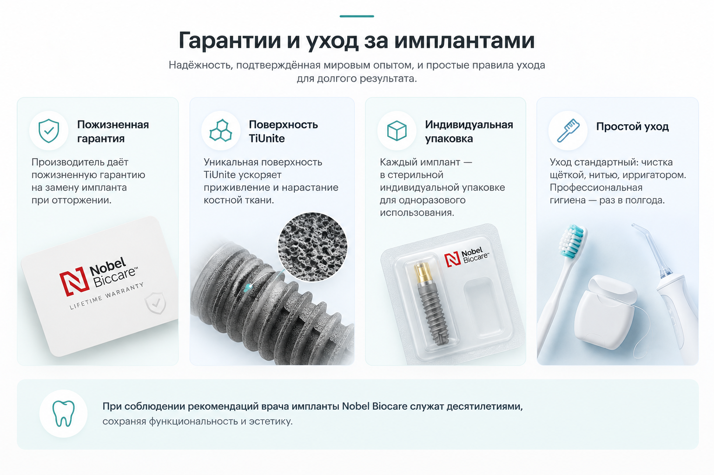

---

## 220. Ассистент — промежуточное сообщение

Сравню оба референса с уже собранными блоками. Использую brainstorming для выбора композиции; пока ничего на странице не меняю.

---

## 221. Ассистент

Ксюша, я бы взяла за основу **первый вариант: текст слева, одна фотография справа**. После четырёх карточек этапов это даст смену композиции — страница не будет состоять из одинаковых баннеров.

Во втором референсе одновременно конкурируют иконки, крупные изображения, рамки и градиенты. Для нашего компактного справочного блока это лишнее.

Предлагаю так:

- Заголовок «Гарантии и уход за имплантами» — слева, Arial.
- Под ним четыре коротких абзаца из документа. Ключевые слова выделяем полужирным, остальной текст — привычным серым Montserrat.
- Без карточек, нумерации, дополнительных кнопок и цветной подложки.
- Справа — одна фотография с небольшим скруглением углов. На мобильных она располагается после текста.

**Для фотографии я бы выбрала сцену объяснения ухода:** гигиенист в светлом кабинете показывает женщине 60–65 лет на модели челюсти, как пользоваться щёткой. Пациентка внимательно смотрит, общение естественное, никто не позирует в камеру. Кадр достаточно крупный, чтобы были понятны руки, модель и действие; без инструментов во рту и хирургических деталей.

Так фотография показывает именно заботу после лечения. Гарантии при этом раскрываются в тексте — не нужно пытаться уместить все четыре темы в одну картинку.

Альтернатива без людей — спокойная предметная фотография щётки, нити и ирригатора. Она лаконичнее, но менее личная. **Мой выбор — врач объясняет уход пациентке**, желательно на настоящем фото вашей клиники.

Берём такую сцену за основу?

---

## 222. Пользователь

Да, хорошо, мне нравится. Только важно врача показать как бы со спины, то есть вообще минимально его показать, чтобы не было какой-то конкретики привязки к конкретному врачу. Весь акцент идет на то, на что он показывает и на пациентку. Важно, чтобы фон был такой чисто стерильное место, желательно размытое, никаких бежевых оттенков. В стоматологии Подмосковья прям всё белое, вот прям вот буквально белое.

---

## 223. Ассистент — промежуточное сообщение

Да, сделаю акцент на пациентке и модели челюсти: врач лишь частично в кадре, со спины, без видимого лица. Кабинет — белый, с мягко размытым фоном, без бежевых оттенков. Использую навык imagegen для иллюстрации, затем размещу её рядом с текстом блока 6.

---

## 224. Ассистент — промежуточное сообщение

Иллюстрация готова: лицо врача не видно, внимание направлено на пациентку и демонстрацию ухода, интерьер белый. Теперь собираю блок с четырьмя абзацами из ТЗ — без рамок и дополнительных декоративных элементов.

---

## 225. Ассистент — промежуточное сообщение

Блок добавлен: слева текст, справа иллюстрация; на телефоне изображение идёт после текста. Для локального просмотра фото подключено из папки генерации: копирование в папку проекта сейчас блокируется системой. Перед переносом на GitHub его нужно будет включить в файлы проекта.

---

## 226. Ассистент

Готово: врач показан со спины, без лица; акцент — на пациентке и демонстрации ухода. Интерьер белый, без бежевых оттенков. Иллюстрацию разместила рядом с текстом блока 6.

[Посмотреть блок «Гарантии и уход»](http://127.0.0.1:4173/?v=block6#implant-care)

---

## 227. Пользователь

Да, супер, отлично, берем, мне нравится.

---

## 228. Ассистент

Отлично, блок 6 утверждён, оставляем как есть. Следующий по ТЗ — блок 7: отзывы и рейтинги.

---

## 229. Пользователь

[https://www.mc-podmoskovie.ru/services/whitening/](https://www.mc-podmoskovie.ru/services/whitening/) Далее переходим к блоку номер семь — отзывы, социальные доказательства. Давай так, дадим этому отзывы, ну то есть так и напишем раздел Отзывы, вот, и перенесем полностью, переносим с существующего сайта как раз вот эти рейтинги. Я сейчас тебе скину ссылочку, где это всё дело лежит. Возьми, пожалуйста, и просто мы это переносим, то есть так же, как на десктоп-версии, на мобильной версии это мы не трогаем, берем уже существующий функционал.

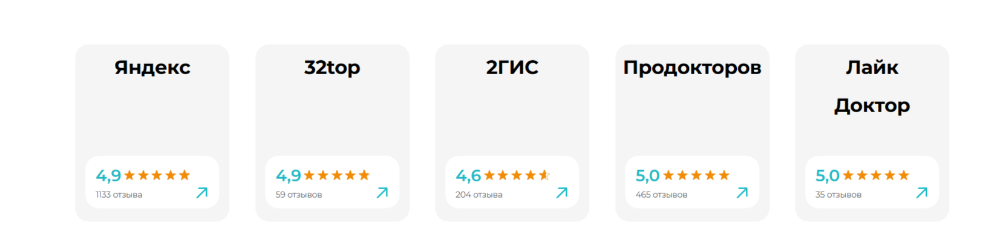

---

## 230. Ассистент — промежуточное сообщение

Перенесу рейтинги со страницы отбеливания под заголовком «Отзывы», сохранив исходное оформление, ссылки и поведение на мобильных. Сначала проверю разметку и стили этого блока.

---

## 231. Ассистент — промежуточное сообщение

На исходной странице пять рейтингов. На мобильных они располагаются вертикально, без слайдера. Сохраню этот вариант, текущие оценки, количество отзывов и ссылки на площадки; добавлю только заголовок «Отзывы».

---

## 232. Ассистент

Добавила раздел «Отзывы»: перенесла пять рейтингов с оценками, количеством отзывов и ссылками. Сохранена исходная раскладка: ряд на десктопе, вертикальный список на мобильных.

[Посмотреть блок «Отзывы»](http://127.0.0.1:4173/?v=reviews#reviews)

---

## 233. Пользователь

[https://www.mc-podmoskovie.ru/services/implant/](https://www.mc-podmoskovie.ru/services/implant/) Далее. У нас с тобой идет блок 8, но там идут противопоказания. И комментарий от клиента звучит так: оставить на сократить до списка расположения после блока доверия перед финальной формой обратной связи. То есть получается, что после отзывов у нас будут идти вопросы и ответы. Здесь у нас отображается несколько видов вопросов. Нужно визуально перенести так же, как у нас сейчас это уже сделано. Ссылку я тебе также сейчас прилагаю. Нужно придумать короткие ответы на основе страницы, получается, имплантация, которая Nobel Biocare, и указать. То есть давай хотя бы начнем с существующих вопросов, у нас их всего 5 штук. Давай с них начнем. Вот. И после него у нас уже будет идти блок противопоказания или тоже на подумать. Противопоказания можно добавить тоже в вопросы-ответы как некий последний вопрос. Как ты думаешь, как лучше это сделать? Тоже буду ждать тебе обратную связь.

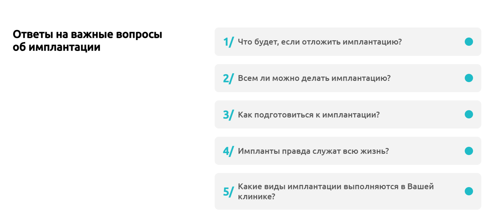

---

## 234. Ассистент — промежуточное сообщение

Проверю информацию на странице Nobel Biocare и подготовлю короткие ответы на пять вопросов из ТЗ. Отдельно предложу, как разместить противопоказания, чтобы они были заметны и не перегружали блок. Пока страницу не меняю.

---

## 235. Ассистент

Ксюша, я бы оставила **пять вопросов из ТЗ, а противопоказания добавила шестым пунктом**: «Какие есть противопоказания к имплантации?». Внутри — короткий список и пояснение, что решение принимает хирург после обследования.

Так последовательность будет логичной: **Отзывы → Вопросы и ответы → Форма записи**. Отдельный большой блок противопоказаний не потребуется. Если клиенту важно видеть список сразу, шестой пункт можно сделать раскрытым по умолчанию.

Визуально переносим ваш референс: заголовок слева, серые раскрывающиеся строки справа, бирюзовая нумерация. На мобильных — заголовок над вопросами.

Для пяти вопросов из ТЗ предлагаю такие короткие ответы:

1. **Больно ли ставить имплант?**  
   «Операцию проводят с обезболиванием. В клинике также доступны седация и наркоз; подходящий вариант врач подбирает индивидуально». Возможность лечения в седации и наркозе подтверждена на [странице имплантации](https://www.mc-podmoskovie.ru/services/implant/).

2. **Сколько служат импланты Nobel Biocare и Zygoma?**  
   «Срок службы зависит от клинической ситуации, ухода и регулярных осмотров. Пожизненная гарантия производителя предусматривает замену импланта при отторжении — это не обещание бессрочной службы всей конструкции». Основание — [раздел гарантий Nobel Biocare](https://www.mc-podmoskovie.ru/services/implant/implant-nobel-biocar/).

3. **Можно ли в рассрочку?**  
   Условия на проверенных страницах не нашла. Пока безопасная формулировка: «Возможность рассрочки и условия оплаты уточните у администратора клиники».

4. **Сколько длится операция Zygoma?**  
   Точная длительность на странице не указана. Предлагаю: «Продолжительность зависит от объёма вмешательства. Хирург уточнит её после диагностики и составления плана лечения».

5. **Есть ли разница в цене между классической имплантацией и Zygoma?**  
   «Стоимость рассчитывается индивидуально с учётом метода, количества имплантов и протезирования. Точный план и стоимость лечения вы получите после консультации». Это соответствует информации на [странице Nobel Biocare](https://www.mc-podmoskovie.ru/services/implant/implant-nobel-biocar/).

Сам список противопоказаний перед публикацией стоит согласовать с хирургом: на текущем сайте некоторые категории сформулированы слишком широко для безусловного запрета.

Предлагаю согласовать именно этот вариант: **шесть раскрывающихся вопросов, последний — противопоказания**.

---

## 236. Пользователь

[https://www.mc-podmoskovie.ru/services/whitening/](https://www.mc-podmoskovie.ru/services/whitening/) Да, я с тобой согласна. Вообще берем это в работу, вопросы-ответы, последний. Это у нас будет как раз противопоказание. Хорошо. Далее форма обратной связи. Смотри, у нас есть некий визуал, как это должно выглядеть. Сейчас тоже ссылку тебе прикрепляю, чтобы у тебя она была. И согласно техническому заданию после вопросов финальная форма обратной связи. Это у нас как раз имя, номер телефона и также добавляется плюс одно поле — добавить выбор к форме: классическая имплантация, Zigoma, не знаю, нужна консультация. И потом продублировать имя хирурга рядом с формой для тех, кто пришел через Zigoma. Ну вот подумай, пожалуйста, как это правильно сделать, и сразу же тогда берем в работу вопросы-ответы с вопросами и ответами, чтобы при нажатии они открывались все. И дальше мы идем к форме обратной связи. Вот здесь покажи мне, как это может вообще выглядеть в рамках вот той стилистики, которую я тебе показала.

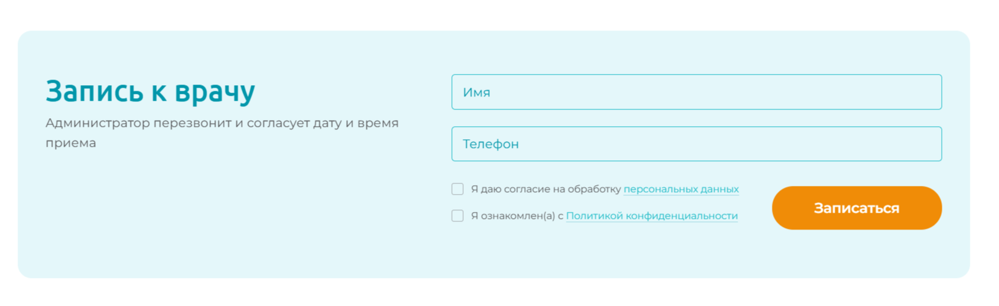

---

## 237. Ассистент — промежуточное сообщение

Соберу шесть раскрывающихся вопросов, затем форму по вашему референсу: светло-бирюзовый фон, имя, телефон и выбор вида имплантации. Имя Геворкяна размещу слева под описанием, с пометкой про Zygoma. В локальном макете форма будет работать без отправки данных в клинику.

---

## 238. Ассистент — промежуточное сообщение

Вопросы и форма уже добавлены. Каждый ответ можно открыть независимо — несколько ответов могут оставаться раскрытыми одновременно. В форме оставила два согласия, как на сайте, а имя хирурга вынесла в текстовую часть, чтобы не перегружать поля.

---

## 239. Ассистент — промежуточное сообщение

Проверила раскрытие ответов и форму: выбор Zygoma работает, после тестовой отправки появляется сообщение «данные не отправлены». Осталась проверка узких экранов. Текст противопоказаний перед публикацией всё же нужно согласовать с хирургом.

---

## 240. Ассистент

Готово: шесть раскрывающихся вопросов, последний — противопоказания. После них — форма с именем, телефоном, выбором имплантации и именем Геворкяна рядом.

[Вопросы и ответы](http://127.0.0.1:4173/?v=final-blocks#faq) · [Форма записи](http://127.0.0.1:4173/?v=final-blocks#appointment)

Проверила мобильные 390 и 430 px. Форма пока демонстрационная, данные не отправляет. Противопоказания перед публикацией нужно согласовать с хирургом.

---

## 241. Пользователь

У тебя не совсем корректно показывает анимация. Смотри, я прилагаю тебе пример, как это выглядит на текущем сайте, чтобы у нас всё было в рамках единой фирменной стилистики. Сейчас у нас как будто бы чуть-чуть есть небольшое различие. То есть, когда закрыто, просто бирюзовый кружок, когда мы с тобой открываем, да, у нас с тобой появляется такого же бирюзового цвета крестик. Это важно поправить.

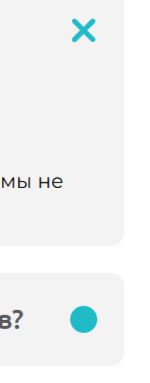

---

## 242. Ассистент — промежуточное сообщение

Исправлю индикатор: в закрытом состоянии — сплошной бирюзовый кружок, в открытом — бирюзовый крестик без кружка. Остальное оформление не меняю.

---

## 243. Ассистент

Исправила: закрыто — бирюзовый кружок, открыто — бирюзовый крестик без фона, как в вашем примере.

[Посмотреть результат](http://127.0.0.1:4173/?v=faq-icons#faq)

---

## 244. Пользователь

Отлично. Теперь что касательно формы обратной связи. Смотри, у меня здесь как бы не совсем есть понимание, поэтому я иду к тебе. Здесь у нас, понятно, три вкладки, там, точнее три поля для заполнения: ваше имя, номер телефона и выбрать подбор по форме, да. Здесь тоже продублировать имя хирурга рядом с формой для тех, кто пришел через блог Зигома. То есть это не для всех, понимаешь? Вот. И поэтому мне как бы хочется понять, как это правильно, логично сделать. То есть получается при выборе Зигомы у нас должен быть какой-то комментарий про врача, ну то есть какая-то форма обратной связи, что, ну там какой-то, может, комментарий, что это именно Геворкян занимается. В общем подумай и напиши мне пока. Пока мы в работу это не берем, пока только анализируем.

---

## 245. Ассистент

Да, теперь понимаю: имя хирурга должно появляться **в контексте выбора Zygoma**, а не постоянно для всех посетителей.

Я предлагаю такую логику:

- **«Классическая имплантация»** — обычная форма, без упоминания конкретного врача.
- **«Zygoma»** — сразу под полем выбора появляется короткое пояснение:  
  «По вопросам скуловой имплантации Zygoma консультирует хирург-имплантолог Геворкян Арарат Гарегинович».  
  Имя — ссылка на карточку врача.
- **«Не знаю, нужна консультация»** — без привязки к врачу: человек может записаться, не разбираясь самостоятельно в методиках.

Это будет небольшой текст внутри той же формы — без дополнительного баннера, фотографии или всплывающего окна. Кнопка остаётся одна: «Записаться». При смене выбора пояснение про Геворкяна исчезает.

Для тех, кто нажал **«Записаться на консультацию к хирургу» в блоке Zygoma**, предлагаю автоматически выбирать Zygoma в финальной форме и показывать это пояснение. Выбор остаётся доступным для изменения. Просто прокрутка мимо блока Zygoma ничего переключать не должна.

При подключении отправки выбранный вариант нужно передавать администратору вместе с именем и телефоном. При этом текст формы не должен обещать подтверждённую запись именно к Геворкяну: дату, время и специалиста ещё согласует администратор.

Так мы убираем постоянное упоминание врача слева и показываем его только тогда, когда оно действительно относится к запросу пациента. Пока ничего не меняю.

---

## 246. Пользователь

делаем

---

## 247. Ассистент — промежуточное сообщение

Сделаю: пояснение про Геворкяна будет появляться только при выборе Zygoma. Кнопка записи в блоке врача будет переводить к форме с уже выбранной Zygoma; при смене варианта пояснение скроется.

---

## 248. Ассистент

Готово. Пояснение про Геворкяна появляется только при выборе Zygoma и скрывается при выборе другого варианта. Кнопка записи в блоке врача переводит к форме с выбранной Zygoma.

[Посмотреть форму](http://127.0.0.1:4173/?v=conditional-doctor#appointment)

---

## 249. Пользователь

Ещё смотри, какой комментарий нашла: сквозные элементы. То есть статик шапка при скролле. Мы с клиентом обсудили, что шапка у нас остаётся на месте, то есть при скролле она у нас не подтягивается. Вот, но клиент просит какую-то форму обратной связи, чтобы при скролле, как здесь top, так и с мобильных устройств, она не навязчиво, а с нами присутствовала. Ты можешь, пожалуйста, показать, как это может выглядеть для того чтобы это интегрировать аккуратно в страницу. Потому что сейчас есть такое ощущение, как будто, ну, она будет лишняя, но при этом я бы всё-таки как-то визуально это показала. То есть получается, что у нас есть какой-то элемент, резюмирую, какой-то элемент, который будет у нас при скролле постоянно оставаться и присутствовать. Может быть, это будет... короче, надо подумать. Давай сейчас подумаем, потом уже решим.

---

## 250. Ассистент

Ксюша, я бы не закрепляла саму форму — она займёт слишком много места. Лучше оставить **небольшую плавающую кнопку «Записаться»**, которая ведёт к нашей финальной форме. Шапка при этом остаётся на месте.

Вижу три варианта:

- **Круглая кнопка с иконкой** — компактная, но без подписи не сразу понятно, что она делает.
- **Нижняя панель на всю ширину** — заметная, но на телефоне будет постоянно закрывать часть страницы.
- **Небольшая кнопка с подписью** — мой выбор: понятная и занимает немного места.

Предлагаю такую реализацию:

**На десктопе:** справа внизу бирюзовая кнопка с закруглёнными краями, небольшой иконкой календаря и подписью «Записаться». Без пульсации, счётчиков и всплывающих приглашений.

**На мобильных:** такая же кнопка, чуть компактнее, высотой около 48 px, с отступом от нижнего края экрана. Не растягиваем её на всю ширину.

Чтобы она не казалась лишней:

- появляется только после того, как главный баннер ушёл с экрана;
- скрывается, когда видна финальная форма;
- по нажатию плавно переводит к форме, сохраняя уже выбранный вариант имплантации;
- сама не раскрывается и не прерывает чтение.

Бирюзовый цвет сделает её спокойнее основных оранжевых кнопок. Это будет постоянный доступ к записи, а не ещё один рекламный баннер.

Я бы сначала показала именно этот вариант на десктопе и телефоне. Пока страницу не меняю.

---

## 251. Пользователь

Смотри, у нас с правой стороны внизу уже есть некий месседж, да, там в Телеграм или в Макс можно перейти. Поэтому я считаю, что здесь нужно её отображать сверху. Возможно, как знаешь, вот закреплённая. То есть там кнопка записи, может быть, она будет как-то закрепишь, что ли. Или может быть, она будет какая-то немножко даже чуть-чуть интерактивная, то есть добавим такую составляющую. Не знаю. Давай, пожалуйста, подумаем с учётом новых вводных данных.

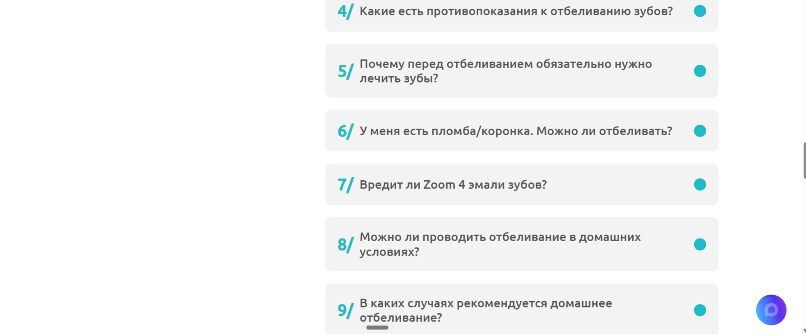

---

## 252. Ассистент

Да, тогда нижний правый угол оставляем мессенджерам. Для записи я бы предложила **компактную закреплённую полоску сверху — отдельно от шапки сайта**.

Как это может выглядеть:

- **На десктопе:** невысокая белая полоска, слева «Консультация имплантолога», справа бирюзовая кнопка «Записаться». Тонкая тень отделяет её от страницы.
- **На мобильных:** та же композиция, но подпись короче — «Консультация», кнопка рядом. Общая высота около 60 px, без логотипа, меню и телефона.

Она появляется, когда главный баннер полностью ушёл с экрана. Сама шапка при этом не закрепляется. Когда пользователь доходит до финальной формы, полоска скрывается.

**Интерактивность — только функциональная:** мягкое появление сверху и переход к форме по нажатию. Без пульсации, подпрыгивания и автоматического раскрытия. Уже выбранный вариант имплантации сохраняется.

Одинокая кнопка сверху тоже возможна, но она будет накладываться прямо на заголовки и изображения. Белая полоска выглядит более собранно; при реализации нужно учесть её высоту, чтобы она не закрывала начало раздела при переходе по ссылкам.

Я бы показала именно этот вариант: **спокойная верхняя полоса записи, внизу — существующие мессенджеры**. Пока ничего не меняю.

---

## 253. Пользователь

Давай, хорошо. Давай сделаем, как ты сказал.

---

## 254. Ассистент — промежуточное сообщение

Добавлю компактную верхнюю полоску записи: она появится после главного баннера и скроется у финальной формы. Шапку и нижний угол с мессенджерами не трогаю; выбранный вид имплантации сохранится.

---

## 255. Ассистент — промежуточное сообщение

Полоска появляется после главного баннера, а у формы скрывается. При проверке заметила нюанс переходов по ссылкам на разделы — добавлю верхний отступ, чтобы полоска не перекрывала их заголовки.

---

## 256. Ассистент

Готово: верхняя полоска появляется после главного баннера и скрывается у формы. Кнопка ведёт к записи, сохраняя выбранный вид имплантации. Шапку не закрепляла.

[Посмотреть на странице](http://127.0.0.1:4173/?v=booking-strip-v2#nobel) · [Мобильный просмотр](http://127.0.0.1:4173/booking-strip-preview.html)

---

## 257. Пользователь

Я еще обнаружила, что где форма обратной связи записаться к врачу у тебя выпадающий список, у тебя там стрелочка немножко поехала, поправь ее, пожалуйста. И если мы пишем классическая имплантация, может быть, это тогда в две строки, потому что у тебя сейчас, например, на маленьких устройствах она не умещается. Вот. В общем, посмотри, пожалуйста, чтобы было хорошо адаптивно как при самых маленьких расширениях экрана, так и при самых больших, и при этом чтобы у нас стрелочка вниз, она выглядела максимально понятно и никуда не уезжала.

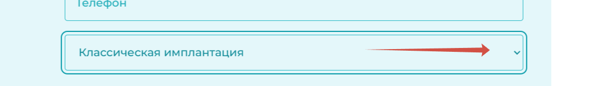

---

## 258. Ассистент — промежуточное сообщение

Поправлю: стрелку закреплю с одинаковым отступом справа, а длинным названиям разрешу переноситься на две строки. Проверю поле на узких и широких экранах, сохранив логику выбора Zygoma.

---

## 259. Ассистент — промежуточное сообщение

Причина — стандартный список браузера: его стрелка и однострочный текст не подстраиваются под нашу вёрстку. Использую подход systematic-debugging: сохраняю штатный выбор вариантов, но отдельно оформляю видимый текст с переносами и стрелку с фиксированным отступом.

---

## 260. Ассистент — промежуточное сообщение

Проверила варианты на ширинах 320, 390, 768, 1440 и 1920 px: длинные названия переносятся, за границы поля не выходят. Сейчас завершаю проверку подсказки о враче при выборе Zygoma.

---

## 261. Ассистент

Исправила: стрелка закреплена с отступом справа, длинные названия на мобильных переносятся на две строки.

Проверила ширины 320–1920 px и выбор Zygoma — подсказка о враче работает.

[Посмотреть форму](http://127.0.0.1:4173/?v=responsive-select#appointment)

---

## 262. Пользователь

А ещё мне нравится твоя идея с консультацией, но у тебя на мобильной версии только отображается консультация имплантолога у тебя, но не показано, то есть только одно слово. Но вообще мне кажется, что её нужно сделать немножко более понятной, потому что сейчас она как будто бы недокручена, то есть нет полноценного призыва к действию, то есть она у нас просто как информативная. Давай, может быть, мы её сделаем более, ну чтобы CTA был хороший, прям понятный, и пользователь прямо хотел нажать на эту кнопку.

---

## 263. Ассистент

Да, слово «Консультация» само по себе не объясняет, зачем нажимать. Я бы сделала так:

На десктопе: **«Узнайте, какая имплантация вам подходит»** → кнопка **«Записаться на консультацию»**.

На мобильном — без отдельной подписи, одна компактная кнопка на всю ширину: **«Подобрать имплантацию →»**. Так текст не теснится, а действие понятно.

По нажатию переходим к нашей форме записи. Не добавляем пульсацию или мигание — достаточно мягкого появления полоски при скролле.

---

## 264. Пользователь

Мне кажется, что, знаете, какая консультация вам подходит? Больше непонятная, чем понятная. То есть мне она вообще ни о чем не говорит. Давай еще подумаем.

---

## 265. Ассистент

Здесь лучше прямо назвать действие — запись к врачу, без «подбора» и абстрактных обещаний.

Я бы предложила:

- На десктопе: «Обсудите восстановление зубов с имплантологом» и кнопка «Записаться на консультацию».
- На мобильном: только кнопка «Записаться к имплантологу →».

Мобильный вариант мне нравится особенно: сразу понятно, к кому записываешься и что произойдёт по нажатию. А уже в форме поясняем, что администратор перезвонит и согласует время.

---

## 266. Пользователь

Обсудите случай с имплантологом  - может так?

---

## 267. Ассистент

Да, это понятнее и короче. Я бы добавила «свой», чтобы обращение звучало естественнее: **«Обсудите свой случай с имплантологом»**.

На десктопе — эта фраза и кнопка «Записаться». На мобильном — одна кнопка «Записаться к имплантологу», чтобы не перегружать полоску.

---

## 268. Пользователь

Хорошо

---

## 269. Ассистент — промежуточное сообщение

Обновлю полоску: на десктопе — «Обсудите свой случай с имплантологом» и «Записаться», на мобильном — одна кнопка «Записаться к имплантологу».

---

## 270. Ассистент

Готово. На десктопе — согласованная фраза и «Записаться», на мобильном — одна кнопка «Записаться к имплантологу».

[Посмотреть результат](http://127.0.0.1:4173/?v=booking-cta#nobel)

---

## 271. Пользователь

Отлично, спасибо тебе большое. Давай мы тогда теперь перейдем к следующему. Во-первых, нужно взять подвал сайта со страницы, где ты брал шапку сайта и сделать ветку на GitHub и скинуть мне уже ссылку на просмотр, чтобы я отправила клиенту на согласование. И, конечно, ссылка имеет публичный доступ, то есть всё хорошо. Здесь я даю своё согласие.

---

## 272. Ассистент — промежуточное сообщение

Добавлю подвал с исходного сайта, затем проверю проект и доступные подключения к GitHub и публикации. Подготовлю отдельную ветку и публичную ссылку для согласования с клиентом.

---

## 273. Ассистент — промежуточное сообщение

Нашла исходник: шапку брали со страницы седации. Переношу оттуда подвал с контактами, навигацией и предупреждением. Также соберу изображения внутрь проекта, чтобы публичная версия не зависела от файлов на вашем компьютере.

---

## 274. Ассистент

Подвал добавлен, изображения подготовлены для публикации.

Осталось уточнить: создаём отдельный GitHub-репозиторий для Nobel и Zygoma или ветку в существующем? Если в существующем — пришлите его название. После этого опубликую страницу и дам публичную ссылку клиенту.

---

## 275. Пользователь

У нас существующего нет, делаем новый

---

## 276. Ассистент — промежуточное сообщение

Создам отдельный репозиторий для Nobel и Zygoma и опубликую страницу с открытым доступом. Затем проверю ссылку, которую можно отправить клиенту.

---

## 277. Ассистент — промежуточное сообщение

Репозиторий и ветка для согласования созданы. GitHub сейчас публикует страницу; после завершения проверю открытие без авторизации. Формы пока остаются демонстрационными — заявки не отправляются.

---

## 278. Ассистент

Готово! [Публичная ссылка для клиента](https://kcska18051-crypto.github.io/podmoskovie-nobel-zygoma/) — открывается без авторизации.

[GitHub, ветка client-review](https://github.com/kcska18051-crypto/podmoskovie-nobel-zygoma/tree/client-review).

Подвал добавлен, загрузка страницы и файлов проверена. Формы пока демонстрационные, заявки не отправляют.

---

## 279. Пользователь

Ты это сделал за одну минуту 45 секунд. Боже мой, я тебя просто обожаю. Прям вот так: обожаю. Всё через тире. Подскажи мне, пожалуйста, ты можешь зайти на сайт Стоматологии Подмосковья и, в принципе, посмотреть, соответствуют ли эти блоки, которые мы с тобой переделали, насколько наша вот эта с тобой страница, она прям полностью соответствует. Во-первых, очень стилистике сайта, во-вторых, техническому заданию, которое прислал клиент, и в целом. И в-третьих, это с точки зрения пользовательского опыта. То есть для меня ответ должен быть у тебя каким: первое — да, второе — да, третье — да. Если нет, указываешь причину. И после этого я отправляю клиенту.

---

## 280. Ассистент — промежуточное сообщение

Проверю страницу по трём пунктам: стилистика действующего сайта, соответствие ТЗ клиента и пользовательский опыт. Пока ничего не меняю — дам честный итог по каждому пункту и отмечу, если что-то стоит поправить перед отправкой.

---

## 281. Ассистент — промежуточное сообщение

Для проверки использую критерии brand-guidelines и ux-researcher-designer: отдельно сверю оформление, требования и путь пациента до записи. Учту и ваши согласованные изменения к ТЗ — например, статичную шапку и противопоказания внутри FAQ.

---

## 282. Ассистент — промежуточное сообщение

Уже нашла два важных расхождения: главный заголовок остался в Montserrat, хотя мы договорились об Arial для заголовков; а у части кнопок записи не подключён переход к форме. Проверю остальные точки входа, чтобы отделить недочёты макета от того, что нормально для демонстрационной версии.

---

## 283. Ассистент

Проверила опубликованную страницу, действующий сайт и файл ТЗ. **До трёх уверенных «да» осталось несколько небольших, но важных правок.**

### 1. Стилистика — да, в рамках нашего согласованного дизайна

Белый фон, бирюзовые акценты, оранжевые кнопки, карточки и форма выглядят частью сайта.

Но главный заголовок остался **Montserrat**, хотя мы согласовали Arial. Ещё нюанс: на действующем сайте заголовки фактически используют **Ubuntu**, поэтому Arial — наше согласованное отличие, а не точное повторение сайта. [Исходная страница](https://www.mc-podmoskovie.ru/services/implant/implant-nobel-biocar/).

### 2. Соответствие ТЗ — по содержанию да, по функционалу пока нет

Все основные смысловые блоки присутствуют. Противопоказания внутри FAQ и статичная шапка соответствуют вашим последующим решениям.

**Недоработка:** ТЗ требует работающих точек записи на первом экране и после видов имплантов. Сейчас эти кнопки не открывают форму и не переводят к ней. Короткой формы на два поля тоже нет — реализована только финальная.

### 3. Пользовательский опыт — логика хорошая, но пока не полное «да»

Путь понятный: ситуация → решение → врач → этапы → доверие → запись. Проверила ширины 320, 390 и 1440 px — горизонтального переполнения нет. FAQ открывается, выбор Zygoma показывает врача.

Но неработающие кнопки прерывают этот путь. **Это моя недоработка, её нужно исправить перед отправкой.**

Дополнительно стоит подтвердить телефон: у нас **60-82-18**, на действующем сайте сейчас **74-45-45**. Это может быть номер коллтрекинга, поэтому автоматически менять его не стоит.

**Мой вывод:** сначала поправить кнопки и главный заголовок, уточнить телефон — затем отправлять клиенту как макет на согласование. Демонстрационная отправка формы допустима для такого показа, если предупредить, что заявки пока не поступают.

---

## 284. Пользователь

Смотри, форма обратной связи будет у нас уже на беке. Сейчас мы только фронт делаем.

---

## 285. Ассистент

Да, поняла. Отправку заявок на бэкенд сейчас не считаем недочётом — для согласования фронтенда она не нужна.

Но реакции кнопок относятся к фронтенду: «Записаться» должна открывать форму или переводить к ней, даже без отправки данных.

Значит, перед отправкой остаются две правки: подключить переходы у кнопок и заменить шрифт главного заголовка на согласованный Arial.

---

## 286. Пользователь

Заголовок пока поменяй)

---

## 287. Ассистент — промежуточное сообщение

Поменяю только главный заголовок на Arial и обновлю публичную страницу. Кнопки пока не трогаю.

---

## 288. Ассистент

Готово 🙂 Главный заголовок теперь Arial. Обновление уже [на публичной странице](https://kcska18051-crypto.github.io/podmoskovie-nobel-zygoma/?v=hero-arial).

Проверила на мобильном и десктопе. Остальное не меняла.

---

## 289. Пользователь

И еще знаешь, что у меня пока что до сих пор форма обратной связи верхней части сайта, который мы с тобой проскролли сделали, она технически выглядит хорошо, но с точки зрения маркетинга мне что-то она не особо до сих пор нравится. Смотри, я закинула в ChatGPT, вот что он предлагает. Может быть мы что-то возьмем в качестве основы. Я сейчас тебе скажу, что мне точно нравится и что мы точно можем взять. Например, консультация имплантолога на мобильных устройствах и кнопка записаться — это прям вообще круто, и, не знаю, какая-то пиктограмма — это уже под вопросом. Надо в десктоп-версии. Обсудите свой случай с имплантологом, подберем решение и даже в сложной ситуации. Это тоже круто. Потом идет некое одно УТП, телефон, ну в случае, если нужно позвонить, и далее уже кнопка записаться. Мне кажется, это вообще вполне логично, понятно и вроде как не особо перегружено. Но я хочу, чтобы ты тоже посмотрел и уже дал мне обратную связь.

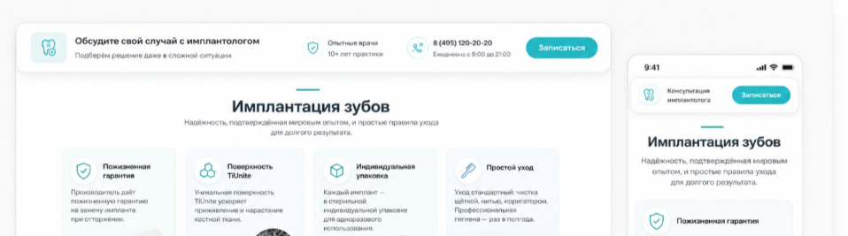

---

## 290. Ассистент — промежуточное сообщение

Посмотрю на референс с точки зрения фирменного стиля и понятности записи: что помогает принять решение, а что лишь занимает место. Пока ничего не меняю.

---

## 291. Ассистент

Да, этот вариант я бы взяла за основу. Здесь появляется понятная связка: **зачем обращаться → почему доверять → как записаться**. Она содержательнее нашей текущей полоски.

На десктопе предлагаю:

- **«Обсудите свой случай с имплантологом»**  
  Под ним: «Рассмотрим варианты восстановления даже в сложной ситуации».
- Один аргумент доверия: **«Сертифицированный центр Nobel Biocare»** — вместо общего «Опытные врачи».
- Кликабельный телефон.
- Кнопка **«Записаться»**.

«Рассмотрим варианты» здесь точнее, чем «Подберём решение»: не обещаем результат до обследования.

На мобильном — именно ваш вариант: **«Консультация имплантолога» в две строки и рядом «Записаться»**. Телефон, дополнительный текст и УТП убираем, чтобы полоска оставалась компактной.

Пиктограмму зуба я бы пока не добавляла: контекст уже понятен, а на маленьком экране важнее сохранить читаемый текст и удобную кнопку.

Визуально оставляем белый фон, лёгкую тень и бирюзовую кнопку. На промежуточных ширинах первым скрываем аргумент доверия, а не уменьшаем шрифты. Так сохраняем фирменную стилистику и не превращаем полоску в ещё одну полноценную шапку.

---

## 292. Пользователь

Супер. Мы можем в целом сначала локально сделать, а потом уже ты, ну как мы согласуем, и ты перенесёшь на бой, если тебе так удобно.

---

## 293. Ассистент — промежуточное сообщение

Да, сделаю сначала локально и покажу вам. Публичную страницу пока не меняю — обновлю только после вашего согласования.

---

## 294. Ассистент

Сделала [локальный вариант](http://127.0.0.1:4173/?v=strip-local#nobel).

На десктопе — обращение, пояснение, аргумент доверия, телефон и кнопка. На мобильном — «Консультация имплантолога» и «Записаться».

Проверила ширины 320–1920 px и переход к форме. Публичную страницу не меняла — жду вашего согласования.

---

## 295. Ассистент

Голосовой разговор завершён.

---

## 296. Пользователь

Привет. Я просто нечаянно нажала на эту кнопку. Смотри, мне нравится, давай перенесем на как раз GitHub и уже после я отправляю клиенту. Только как сделаешь, скинь ссылку, пожалуйста.

---

## 297. Ассистент — промежуточное сообщение

Опубликую согласованную полоску на GitHub и проверю страницу. Затем пришлю публичную ссылку для клиента.

---

## 298. Ассистент

Готово 🙂 Обновление опубликовано. Проверила мобильную и десктопную версии, кнопка полоски переводит к форме.

[Публичная ссылка для клиента](https://kcska18051-crypto.github.io/podmoskovie-nobel-zygoma/?v=consultation-strip) — открывается без авторизации.

---

## 299. Пользователь

Как я тебя обожаю! Спасибо зайчик!

---

## 300. Ассистент

Спасибо за такие тёплые слова 🩵 Очень приятно, что результат радует! Будут комментарии клиента — разберём их вместе.

---

## 301. Пользователь

Перенеси весь диалог на ветку GitHub, чтобы я могла открыть с другого компьютера.

---

## 302. Ассистент — промежуточное сообщение

Сохраню диалог в отдельный Markdown-файл в ветке GitHub, чтобы его можно было открыть с другого компьютера. Репозиторий публичный, поэтому включу сообщения и ссылки на результаты, но исключу служебные данные, токены и локальные пути вашего компьютера.

---

## 303. Ассистент — промежуточное сообщение

Нашла сохранённую историю этой задачи, включая ранние обсуждения и изображения, которые вы прикладывали. Перенесу её в хронологическом порядке — не только краткое резюме.

